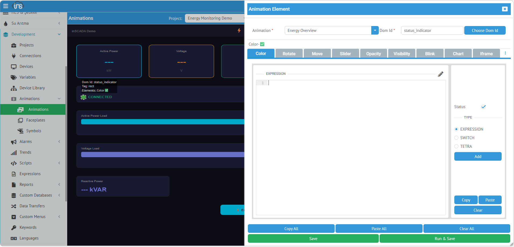
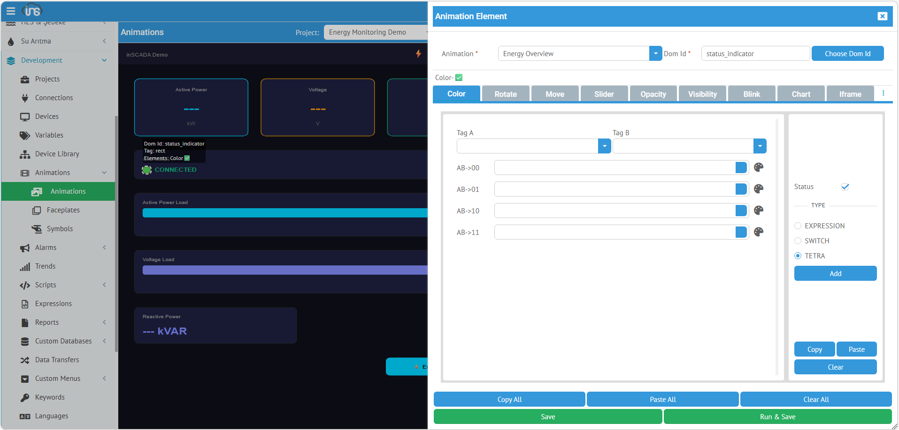

**Color**, bir SVG öğesinin dolgu (fill) veya çizgi (stroke) rengini değişken değerine göre dinamik olarak değiştirir. Durum göstergesi, alarm renklendirme, eşik bazlı görselleştirme için kullanılır.

## Kullanım

| Alan | Değer |
|------|-------|
| **Type** | Color |
| **Uygun SVG Öğeleri** | `<rect>`, `<circle>`, `<ellipse>`, `<polygon>`, `<path>`, `<text>` |

## Yapılandırma Tipleri

### SWITCH — Koşullu Renk Tablosu (Kod Yazmadan)

En yaygın kullanım. Değer aralıklarına göre farklı renkler atanır — kod yazmaya gerek yoktur.


TYPE bölümünden **SWITCH** seçildiğinde değişken seçimi ve koşullu renk tablosu açılır.

#### Temel Alanlar

| Alan | Açıklama |
|------|----------|
| **Variable** | Açılır listeden değişken seçimi |
| **Default** | Hiçbir koşul sağlanmazsa kullanılacak varsayılan renk |

#### Koşul Tablosu (Condition / Value / Color)

**Add** butonuyla satır ekleyerek değer → renk eşleşmeleri tanımlanır. Her satır şu alanlardan oluşur:

| Alan | Açıklama |
|------|----------|
| **Condition** | Karşılaştırma operatörü: `>`, `>=`, `==`, `!=`, `<=`, `<` |
| **Value** | Karşılaştırma değeri |
| **Color** | Birincil renk (koşul sağlandığında uygulanacak) |
| **Second Color** | İkincil renk (yanıp sönme veya gradient için, opsiyonel) |
| **G** | **Gradient** — İşaretlenirse iki renk arasında gradient (renk geçişi) oluşturur |
| **H** | **Horizontal** — Gradient yönü. İşaretlenirse yatay, değilse dikey gradient |

Basit kullanım — yalnızca Condition, Value ve Color doldurulur:

| Condition | Value | Color | Anlam |
|-----------|-------|-------|-------|
| `>` | `80` | 🔴 `#FF0000` | Kritik |
| `>` | `60` | 🟠 `#FF8800` | Uyarı |
| `>` | `40` | 🟡 `#FFCC00` | Dikkat |
| `<=` | `40` | 🟢 `#00CC00` | Normal |

Boolean değişkenler için:

| Condition | Value | Color | Anlam |
|-----------|-------|-------|-------|
| `==` | `true` | 🟢 `#00CC00` | Çalışıyor |
| `==` | `false` | 🔴 `#FF0000` | Durdu |

#### İkincil Renk, Gradient ve Yanıp Sönme

Second Color alanı doldurulduğunda iki farklı davranış oluşur:

| G Checkbox | Davranış |
|-----------|---------|
| **Kapalı** | İki renk arasında **yanıp sönme** efekti (Color ↔ Second Color) |
| **Açık** | İki renk arasında **gradient** (yumuşak renk geçişi) |

H checkbox yalnızca gradient aktifken geçerlidir:

| H Checkbox | Gradient Yönü |
|-----------|--------------|
| **Kapalı** | Dikey gradient (üstten alta) |
| **Açık** | Yatay gradient (soldan sağa) |

Örnek: Sıcaklık 80°C üzerinde kırmızı↔beyaz yanıp sönme → Color: `#FF0000`, Second Color: `#FFFFFF`, G: kapalı

#### Hata Durumu Renkleri

| Alan | Açıklama |
|------|----------|
| **Comm Error Color** | Haberleşme hatası olduğunda gösterilecek renk (örn: gri `#999999`) |
| **Stale Duration** | Verinin "eski" sayılacağı süre (ms) |
| **Stale Color** | Veri güncelliğini yitirdiğinde gösterilecek renk |

:::tip
Comm Error Color ve Stale Color ayarları, operatörlerin haberleşme kesintilerini renk değişiminden hızlıca fark etmesini sağlar.
:::

### EXPRESSION — JavaScript ile Serbest Renk Hesaplama

Karmaşık koşullar veya birden fazla değişkene bağlı renk kararları için kullanılır.



TYPE bölümünden **EXPRESSION** seçildiğinde JavaScript kod editörü açılır. `return` ile döndürülen hex renk kodu SVG öğesine uygulanır.

#### Örnek: Eşik Bazlı Renk

```javascript
var temp = ins.getVariableValue("Temperature_C").value;
if (temp > 80) return "#FF0000";      // kırmızı — kritik
if (temp > 60) return "#FF8800";      // turuncu — uyarı
if (temp > 40) return "#FFCC00";      // sarı — dikkat
return "#00CC00";                     // yeşil — normal
```

#### Örnek: Birden Fazla Değişkene Bağlı

```javascript
var power = ins.getVariableValue("ActivePower_kW").value;
var status = ins.getVariableValue("GridStatus").value;
if (!status) return "#999999";        // bağlantı yok — gri
if (power > 500) return "#FF0000";    // aşırı yük — kırmızı
if (power > 300) return "#FF8800";    // yüksek yük — turuncu
return "#00CC00";                     // normal — yeşil
```

#### Örnek: Yanıp Sönme

İki renk arasında yanıp sönme efekti oluşturmak için `/` ayracı kullanılır:

```javascript
var temp = ins.getVariableValue("Temperature_C").value;
if (temp > 80) return "#FF0000/#FFFFFF";  // kırmızı ↔ beyaz yanıp sönme
return "#00CC00";
```

`/` karakteri ile iki renk belirtildiğinde SVG `<animate>` elementi oluşturulur ve renkler arasında otomatik geçiş yapılır.

### TETRA — Alarm 4 Renk Durumu

Alarm grubunun dört durumuna göre otomatik renklendirme sağlar. Alarm grubu tanımındaki renk ayarlarını kullanır.



TYPE bölümünden **TETRA** seçildiğinde alarm tag bağlama ve 4 durum yapılandırması açılır.

#### Alanlar

| Alan | Açıklama |
|------|----------|
| **Tag** | Alarm değişkeni referansı |
| **Tag K** | Onay (acknowledge) değişkeni referansı |

#### 4 Alarm Durumu

Her satır bir alarm durumunu temsil eder. Her duruma renk ve yanıp sönme (blink) atanabilir:

| Durum | Açıklama | Tipik Renk |
|-------|----------|-----------|
| **AB-on (ack)** | Alarm aktif, onaylanmış | 🔴 Kırmızı sabit |
| **AB-on (no ack)** | Alarm aktif, onaylanmamış | 🔴 Kırmızı yanıp söner |
| **AB-off (ack)** | Alarm kapanmış, onaylanmış | ⚪ Normal (gri/beyaz) |
| **AB-off (no ack)** | Alarm kapanmış, onaylanmamış | 🟡 Sarı |

Her satırdaki checkbox yanıp sönme efektini etkinleştirir.

:::note
TETRA tipi, alarm grubu tanımındaki renk kodlarıyla (OnNoAck, OnAck, OffNoAck, OffAck) uyumlu çalışır. Renkleri elle ayarlamanıza gerek yoktur — alarm grubundaki yapılandırmayı kullanır.
:::

---

## Ne Zaman Hangi Tip?

| İhtiyaç | Önerilen Tip |
|---------|-------------|
| Değer aralığına göre renk, hızlı yapılandırma | **SWITCH** |
| Birden fazla değişkene bağlı karmaşık koşul | **EXPRESSION** |
| Alarm durumu renklendirme (4 durum) | **TETRA** |
| Yanıp sönme efekti | **EXPRESSION** (`renk1/renk2` formatı) |

## Tam SVG Örneği

```xml
<svg viewBox="0 0 300 100">
  <!-- 3 motor durum göstergesi -->
  <g transform="translate(30,50)">
    <circle id="motor1_led" r="15" fill="#ccc"/>
    <text y="35" text-anchor="middle" font-size="11">Motor 1</text>
  </g>
  <g transform="translate(150,50)">
    <circle id="motor2_led" r="15" fill="#ccc"/>
    <text y="35" text-anchor="middle" font-size="11">Motor 2</text>
  </g>
  <g transform="translate(270,50)">
    <circle id="motor3_led" r="15" fill="#ccc"/>
    <text y="35" text-anchor="middle" font-size="11">Motor 3</text>
  </g>
</svg>
```

Her `motor*_led` için Color element:
- TYPE: SWITCH
- Variable: `Motor1_Status`
- Switch: `true → #00CC00` | `false → #FF0000`
