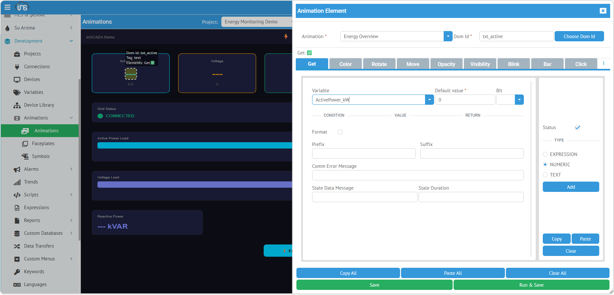

**Get**, bir SVG text öğesinin içeriğini değişken değeriyle güncelleyen en temel animation tipidir. Sayısal gösterge, etiket, durum metni gibi tüm metin tabanlı gösterimler için kullanılır.

## Kullanım

| Alan | Değer |
|------|-------|
| **Type** | Get |
| **Uygun SVG Öğeleri** | `<text>`, `<tspan>` |

## Yapılandırma Tipleri

Get element'inde değerin nasıl belirleneceğini seçmek için sağ taraftaki **TYPE** bölümünden seçim yapılır. Her tip farklı bir yapılandırma arayüzü sunar.

### NUMERIC — Değişken Seçimi (Kod Yazmadan)

En hızlı ve en yaygın kullanım. Projedeki değişkenleri listeden seçerek doğrudan bağlarsınız — kod yazmaya gerek yoktur.



TYPE bölümünden **NUMERIC** seçildiğinde sol tarafta değişken seçimi ve görüntüleme ayarları açılır. Yukarıdaki screenshot'ta SVG üzerinde `txt_active` (text) objesi seçilmiş ve `ActivePower_kW` değişkenine bağlanmıştır.

#### Temel Alanlar

| Alan | Açıklama |
|------|----------|
| **Variable** | Açılır listeden değişken seçimi. Projedeki tüm değişkenler listelenir |
| **Default value** | Değer henüz okunamamışsa gösterilecek varsayılan metin (örn: `0`, `---`, `N/A`) |
| **Bit** | Değerin belirli bir bit'ini göstermek için bit numarası. Word/Integer değişkenlerde tek bir bit durumunu izlemek için kullanılır (opsiyonel) |

#### Koşullu Gösterim (Condition / Value / Return)

Değer aralıklarına göre farklı metinler döndürmek için koşul tablosu kullanılır. **Add** butonuna tıklayarak satır eklenir:

| Condition | Value | Return |
|-----------|-------|--------|
| `>` | `80` | `Yüksek` |
| `>` | `60` | `Normal` |
| `<=` | `60` | `Düşük` |

Bu tablo, SWITCH expression tipine benzer bir işlev sağlar — ancak kod yazmadan görsel olarak yapılandırılır.

#### Görüntüleme Ayarları

| Alan | Açıklama |
|------|----------|
| **Format** | İşaretlenirse değer sayısal formatlama ile gösterilir (ondalık basamak, binlik ayracı) |
| **Prefix** | Değerin önüne eklenen metin (örn: `$`, `≈`) |
| **Suffix** | Değerin sonuna eklenen metin (örn: ` kW`, ` °C`, ` V`) |

Prefix ve Suffix ile kod yazmadan birimli gösterim oluşturulabilir:
- Prefix: boş, Suffix: ` kW` → `359.91 kW`
- Prefix: `≈ `, Suffix: ` V` → `≈ 235.3 V`

#### Hata Durumu Mesajları

| Alan | Açıklama |
|------|----------|
| **Comm Error Message** | Haberleşme hatası olduğunda gösterilecek metin (örn: `COMM ERR`, `---`) |
| **Stale Data Message** | Veri güncelliğini yitirdiğinde gösterilecek metin (örn: `STALE`, `Eski Veri`) |
| **Stale Duration** | Verinin "eski" sayılacağı süre (ms). Bu süre boyunca değer güncellenmezse Stale Data Message gösterilir |

:::tip
Comm Error Message ve Stale Data Message, operatörlerin haberleşme kesintilerini hızlıca fark etmesini sağlar. Kritik göstergelerde mutlaka ayarlanması önerilir.
:::

### EXPRESSION — JavaScript ile Serbest Hesaplama

İleri düzey kullanım. Formatlama, birim ekleme, birden fazla değişkenden hesaplama veya koşullu metin için kullanılır.


TYPE bölümünden **EXPRESSION** seçildiğinde sol tarafta JavaScript kod editörü açılır. `return` ile döndürülen değer text öğesine yazılır.

#### Örnek: Değer + Birim

```javascript
return ins.getVariableValue('ActivePower_kW').value;
```

#### Örnek: Formatlı Gösterim

```javascript
var val = ins.getVariableValue("ActivePower_kW");
return val.value.toFixed(1) + " kW";
```
Sonuç: `359.9 kW`

#### Örnek: Birim ve Ondalık

```javascript
var val = ins.getVariableValue("Temperature_C");
return val.value.toFixed(1) + " °C";
```
Sonuç: `45.2 °C`

#### Örnek: Boolean Durum Metni

```javascript
var status = ins.getVariableValue("GridStatus").value;
return status ? "ONLINE" : "OFFLINE";
```

#### Örnek: Zaman Damgası

```javascript
var val = ins.getVariableValue("ActivePower_kW");
var d = new Date(val.dateInMs);
var h = ("0" + d.getHours()).slice(-2);
var m = ("0" + d.getMinutes()).slice(-2);
var s = ("0" + d.getSeconds()).slice(-2);
return h + ":" + m + ":" + s;
```
Sonuç: `14:32:05`

#### Örnek: Birden Fazla Değişken

```javascript
var p = ins.getVariableValue("ActivePower_kW").value;
var v = ins.getVariableValue("Voltage_V").value;
var i = ins.getVariableValue("Current_A").value;
return p.toFixed(0) + " kW | " + v.toFixed(0) + " V | " + i.toFixed(1) + " A";
```
Sonuç: `360 kW | 235 V | 36.2 A`

### TEXT — Sabit Metin

Dinamik olmayan, her zaman aynı kalan sabit metin göstermek için kullanılır.


TYPE bölümünden **TEXT** seçildiğinde sol tarafta basit metin giriş alanı açılır. Girilen metin doğrudan text öğesine yazılır.

Kullanım senaryoları:
- Etiket metni (örn: "Aktif Güç", "Sıcaklık")
- Birim gösterimi
- Statik başlık veya açıklama

### SWITCH — Değere Göre Metin Eşleşme

Sayısal veya boolean değere göre farklı metinler göstermek için kullanılır. Değer → metin eşleşme tablosu tanımlanır.

Örnek:
```
0 → Durdu
1 → Çalışıyor
2 → Arıza
3 → Bakım
```

---

## Ne Zaman Hangi Tip?

| İhtiyaç | Önerilen Tip |
|---------|-------------|
| Basit değer gösterimi, hızlı yapılandırma | **NUMERIC** |
| Formatlama, birim, hesaplama | **EXPRESSION** |
| Sabit etiket/başlık | **TEXT** |
| Durum kodu → metin dönüşümü | **SWITCH** |

:::tip
Çoğu durumda **NUMERIC** yeterlidir — listeden değişken seçin, kaydedin. Formatlama veya birden fazla değişken gerektiğinde **EXPRESSION** kullanın.
:::

