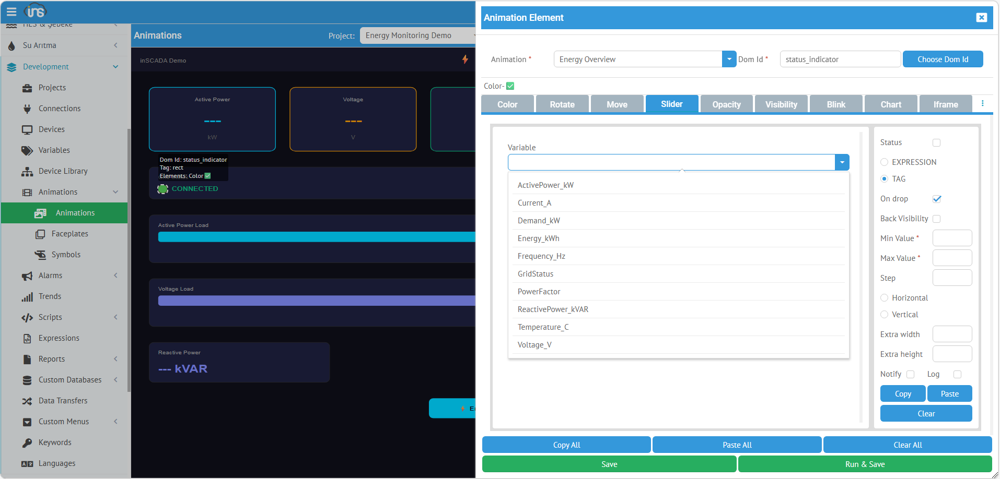
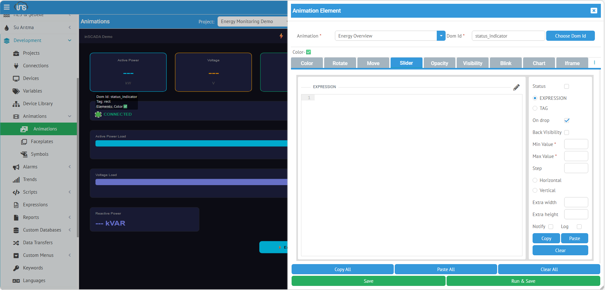

## Slider (Kaydırıcı)

**Slider**, sürüklenebilir kaydırıcı ile analog değer ayarlamak için kullanılır. Setpoint, hız ayarı, sıcaklık hedefi, dimmer gibi sürekli değer kontrolleri.

| Alan | Değer |
|------|-------|
| **Type** | Slider |
| **Uygun SVG Öğeleri** | `<rect>` (foreignObject olarak render edilir) |

### TAG — Değişken Seçimi



Listeden değişken seçilir. Operatör kaydırıcıyı sürüklediğinde değer doğrudan değişkene yazılır.

| Alan | Açıklama |
|------|----------|
| **Variable** | Açılır listeden hedef değişken seçimi |
| **Back Visibility** | Kaydırıcının arka plan dikdörtgenini göster/gizle |
| **Min Value** | Kaydırıcı minimum değeri |
| **Max Value** | Kaydırıcı maksimum değeri |
| **Extra Width** | Kaydırıcı genişliğine ek piksel |
| **Extra Height** | Kaydırıcı yüksekliğine ek piksel |

### EXPRESSION — JavaScript ile



Expression modunda da aynı yapılandırma alanları kullanılır. Expression, slider'ın mevcut değerini hesaplamak veya yazma öncesi dönüşüm yapmak için kullanılabilir.

| Alan | Açıklama |
|------|----------|
| **Back Visibility** | Arka plan görünürlüğü |
| **Min Value / Max Value** | Değer aralığı |
| **Extra Width / Extra Height** | Boyut ayarı |

### Çalışma Prensibi

Slider, **noUiSlider** kütüphanesi ile render edilir. Operatör kaydırıcıyı sürüklediğinde:

1. Slider pozisyonu Min-Max aralığına göre değere dönüştürülür
2. Değer API aracılığıyla değişkene yazılır
3. SVG rect alanı içine foreignObject olarak yerleştirilir

:::caution
Slider kontrol element'idir — kullanıcının `SET_VARIABLE_VALUE` yetkisi gereklidir.
:::

---

## Input (Giriş Alanı)

**Input**, metin veya sayı giriş alanı oluşturur. Operatör klavyeden değer girer ve Enter ile onaylar.

| Alan | Değer |
|------|-------|
| **Type** | Input |
| **Uygun SVG Öğeleri** | `<rect>` (foreignObject olarak render edilir) |

### Yapılandırma

| Alan | Açıklama | Örnek |
|------|----------|-------|
| **type** | Giriş tipi | `number`, `text` |
| **min** | Minimum değer (number) | 0 |
| **max** | Maksimum değer (number) | 100 |
| **placeholder** | Boş iken gösterilen metin | "Setpoint girin..." |

### Kullanım Senaryoları

**Sayısal setpoint:**
- Variable: `Temperature_Setpoint`
- Tip: number, min: 0, max: 100

**Tarif adı:**
- Variable: `Recipe_Name`
- Tip: text, placeholder: "Tarif adı..."

**Validasyonlu giriş (Expression ile):**
```javascript
var val = parseFloat(value);
if (val < 0 || val > 100) {
    ins.notify("error", "Hata", "Değer 0-100 aralığında olmalı!");
    return;
}
ins.setVariableValue("Setpoint", {value: val});
ins.notify("success", "OK", "Setpoint güncellendi: " + val);
```

:::caution
Input kontrol element'idir — kullanıcının `SET_VARIABLE_VALUE` yetkisi gereklidir.
:::
