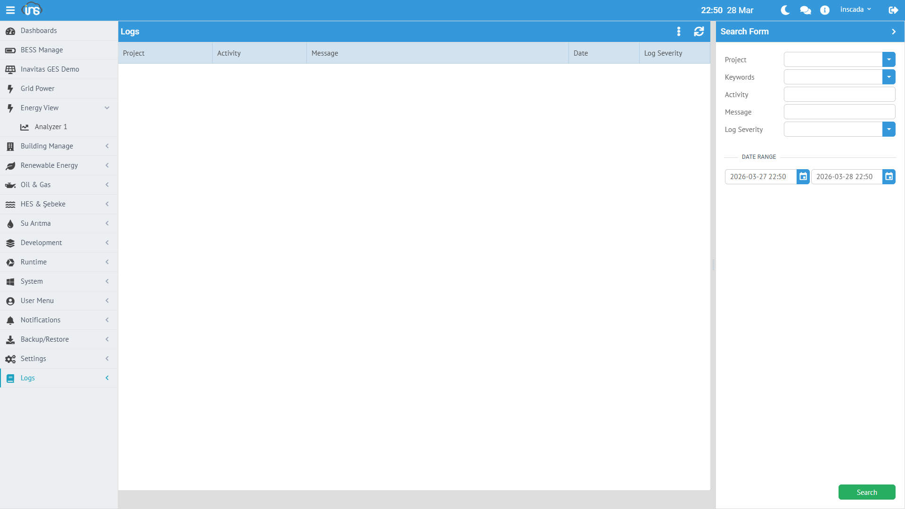
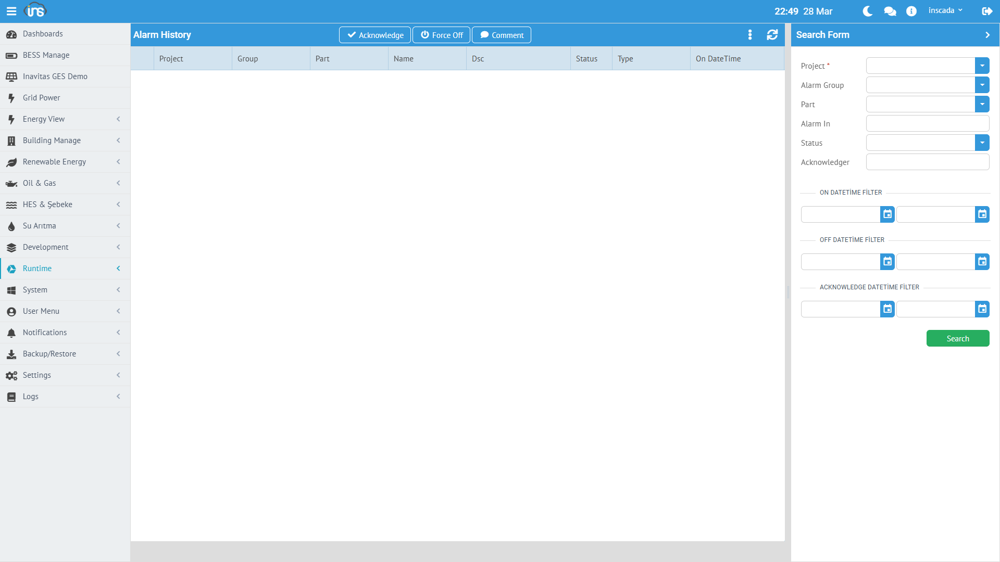

inSCADA is a SCADA platform designed to collect, process, visualize, and automate data from field devices. It runs as a single application — all components are bundled in a single file.

## Data Hierarchy

All data in inSCADA is organized in the following hierarchical structure:

```
Space
│
├── [Space-Level Components]
│   ├── Custom Menu
│   ├── Dashboard
│   ├── Expression (Shared Formulas)
│   └── Symbol (SVG Symbol Library)
│
└── Project
    │
    ├── [Communication]
    │   └── Connection
    │       └── Device
    │           └── Frame (Data Frame)
    │               └── Variable
    │
    ├── [Monitoring & Alarm]
    │   ├── Alarm Group
    │   │   └── Alarm Definition
    │   └── Trend (Trend Chart)
    │       └── Trend Tag
    │
    ├── [Automation]
    │   ├── Script (Automation Script)
    │   └── Data Transfer
    │
    ├── [Visualization]
    │   ├── Animation (SVG Screen)
    │   └── Faceplate (Reusable Component)
    │
    └── [Reporting]
        └── Report
```

:::note[Space vs. Project]
**Custom Menu**, **Dashboard**, **Expression**, and **Symbol** are defined at the space level — they can be shared across all projects. All other components are bound to a project.
:::

### Space

Space is the top-level isolation unit. Each space has its own set of projects, users, and configurations. Different spaces are completely independent of each other.

Use cases:
- **Customer isolation** — a separate space for each customer
- **Environment separation** — development, testing, production
- **Department separation** — energy, water, building automation

### Project

A project represents a facility, site, or logical unit. There can be multiple projects under a space. All components within a project (connections, alarms, scripts, screens, etc.) operate within the project scope.

Example projects:
- "Ankara Factory" — a manufacturing facility
- "SPP-01" — a solar power plant
- "Building-A HVAC" — a building's HVAC system

Each project can optionally have **latitude/longitude** coordinates and can be visualized on the map screen.

### Connection

A connection is the communication channel to a field device or system. Each connection uses a protocol.

Supported protocols:

| Group | Protocols |
|-------|-----------|
| **Industrial** | MODBUS TCP/UDP/RTU, S7, EtherNet/IP, Fatek |
| **Energy** | DNP3, IEC 60870-5-104, IEC 61850 |
| **Open Standard** | OPC UA, OPC DA, OPC XML, MQTT |
| **Local** | LOCAL (simulation / internal calculation) |

Each connection can be started and stopped independently, and its status can be monitored (Connected, Disconnected, Error).

### Device

A device represents a physical or logical unit on a connection. For example, there can be multiple slave devices on a single MODBUS connection.

### Frame (Data Frame)

A frame is a data block read from a device. Each frame defines a specific address range and read period.

| Parameter | Description |
|-----------|-------------|
| **Start Address** | The first address to read |
| **Quantity** | Number of registers/points to read |
| **Period** | Read frequency (ms) |

:::tip
Frame is critical for performance optimization. Grouping consecutive addresses into a single frame is much more efficient than reading them individually.
:::

### Variable

A variable is the most fundamental data unit in the platform. A temperature measurement, a motor status, a counter value — each one is a variable.

Key properties of each variable:

| Property | Description |
|----------|-------------|
| **Name** | Unique name (within the project) |
| **Type** | Float, Integer, Boolean, String |
| **Unit** | Engineering unit (°C, kW, bar, V, A...) |
| **Scaling** | Raw → Engineering conversion (engZeroScale, engFullScale) |
| **Logging** | Historical data recording type and period |
| **Expression** | Custom value calculation formula |

#### Scaling

The raw value is linearly converted to the engineering value:

```
Engineering = engZeroScale + (raw - rawZeroScale) ×
              (engFullScale - engZeroScale) / (rawFullScale - rawZeroScale)
```

Example: 4-20mA sensor → 0-100°C scaling:
- Raw: 4mA → 0°C, 20mA → 100°C
- engZeroScale=0, engFullScale=100, rawZeroScale=4, rawFullScale=20

#### Logging Types

| Type | Description |
|------|-------------|
| **Periodically** | Records at fixed intervals (logPeriod seconds) |
| **When Changed** | Records when the value changes |
| **None** | No recording |

#### Value Expression

A custom calculation formula can be assigned to a variable. This formula runs on every read cycle, and its result becomes the variable's value:

```javascript
// Example: Sine wave simulation
var t = new Date().getTime() / 1000;
return (Math.sin(t / 60) * 150 + 450).toFixed(2) * 1;
```

---

## Alarm System

### Alarm Group

Alarms are organized in groups. Each alarm group belongs to a project and can be enabled/disabled as a whole.

```
Project
└── Alarm Group (e.g., "Temperature Alarms")
    ├── Alarm: Temperature_C > 60°C (High Temperature)
    ├── Alarm: Temperature_C > 80°C (Critical Temperature)
    └── Alarm: Temperature_C < 10°C (Low Temperature)
```

### Alarm Types

| Type | Description | Parameters |
|------|-------------|------------|
| **Analog** | Numeric value threshold check | High, High-High, Low, Low-Low |
| **Digital** | Boolean state check | ON → Alarm, OFF → Normal |
| **Custom** | Script-based custom condition | JavaScript expression |

### Alarm Lifecycle

```
Normal → Fired → Acknowledged → Off
```

Every alarm event is recorded historically: fire time, off time, acknowledging user, duration.

---

## Script Engine

Scripts are the platform's automation engine. They run server-side and can access all platform data.

### Script Use Cases

| Area | Description | Example |
|------|-------------|---------|
| **Scheduled task** | Periodic or timed execution | Energy calculation every 10 seconds |
| **Variable formula** | Value transformation | Deriving a third variable from two others |
| **Alarm condition** | Custom alarm logic | Condition dependent on multiple variables |
| **Data integration** | REST API call | Fetching data from a weather API |
| **Reporting** | Automated report | Sending a PDF report by email every morning |
| **Notification** | Event-based notification | Sending an SMS when an alarm fires |

### Schedule Types

| Type | Usage |
|------|-------|
| **Periodic** | Runs every X milliseconds |
| **Daily** | Runs at a specific time every day |
| **Once** | Runs once and stops |
| **None** | Triggered only manually or via API |

Details: [Script Engine →](/docs/tr/platform/scripts/)

---

## Visualization Components

### Animation (SVG Screen) — Project Level



SVG-based interactive SCADA screens. Variable values are displayed in real time on the screen: color changes, motion, numeric display, on/off controls.

### Faceplate — Project Level

Reusable SVG components. Frequently used visual elements such as motors, valves, and pumps can be defined as faceplates and used across multiple animation screens.

### Symbol (SVG Symbol Library) — Space Level

SVG symbol library shared across the space. Animations and faceplates in all projects can use these symbols.

### Dashboard — Space Level

Used to combine data from different projects into a single dashboard. Since it is defined at the space level, cross-project data comparison is possible.

### Trend Chart — Project Level

Charts showing the change of variables over time. Multiple variables can be shown on the same chart (Trend Tag). Used for historical data review and comparison.

### Custom Menu — Space Level

Used to create custom menu structures for users. Defined at the space level — different menus can be assigned to different roles. An operator sees only monitoring screens, a manager sees reports, and an engineer sees configuration pages.

### Report — Project Level

The reporting system produces output in PDF and Excel formats. Reports can be scheduled, sent by email, or saved to file.

### Expression (Shared Formula) — Space Level

Calculation formulas shared across the space. Can be used by multiple variables or alarms. Enables centralized management of repeated formulas.

### Project Map



Displays the geographic locations of projects on a GIS map. At each project point, real-time values, alarm status, and connection status are shown as a popup.

---

## Database Structure

inSCADA uses three different database layers. Each is optimized for a different data type:

### Configuration Database

Project definitions, variable settings, users, roles, alarm definitions, script code — all platform configuration data is stored here.

This data rarely changes, has a relational structure, and consistency is the priority.

### Time Series Database

Variable historical values, alarm history, event logs, login attempts — all time-stamped data is stored here.

This data is continuously written, rarely updated, and queried by time range. Old data can be automatically cleaned up with retention policies.

| Data Type | Default Retention |
|-----------|-------------------|
| Variable values | 365 days |
| Alarm history | 365 days |
| Event logs | 14 days |
| Login attempts | 365 days |

### Real-Time Value Cache

The **latest current values** of all variables are kept in memory (cache). When a value is read via `ins.getVariableValue()` or the REST API, it returns from the cache — no database query is needed.

This provides:
- Real-time value read < 1ms
- Thousands of variables can be read simultaneously
- Web interface and scripts access the same up-to-date data

---

## Data Flow

The path data follows from a field device to the web screen:

```
┌─────────┐    ┌──────────┐    ┌─────────┐    ┌────────┐    ┌────────┐
│  Field   │───▶│Connection│───▶│  Frame   │───▶│  Raw   │───▶│Scaling │
│ Device   │    │(Protocol)│    │ (Read)   │    │ Value  │    │        │
└─────────┘    └──────────┘    └─────────┘    └────────┘    └───┬────┘
                                                                │
                    ┌───────────────────────────────────────────┘
                    │
                    ▼
              ┌──────────┐    ┌──────────┐    ┌──────────┐
              │  Cache   │───▶│ Logging  │    │  Alarm   │
              │(Real-time)│   │(History) │    │  Check   │
              └────┬─────┘    └──────────┘    └──────────┘
                   │
          ┌────────┼────────┐
          ▼        ▼        ▼
     ┌────────┐┌────────┐┌────────┐
     │  Web   ││ Script ││  REST  │
     │  UI    ││ Engine ││  API   │
     └────────┘└────────┘└────────┘
```

1. **Field Device** — PLC, RTU, sensor, meter, etc.
2. **Connection** — Connects to the device using the specified protocol
3. **Frame Read** — Reads the address block at the defined period
4. **Raw Value** — Raw data received from the device
5. **Scaling** — Raw → Engineering conversion (if applicable)
6. **Cache** — Current value is written to the in-memory cache
7. **Logging** — Records to the time series database based on logging type
8. **Alarm Check** — Threshold check based on alarm definitions
9. **Consumption** — Web UI (WebSocket), Script Engine, REST API all read from the same cache

### Write Flow (Sending Commands)

```
UI / Script / API → Cache Update → Connection → Protocol Write → Field Device
```

When a value is written via `ins.setVariableValue()` or the UI, the command is sent to the field device through the connection.

---

## Multi-Tenant (Multiple Workspaces)

```
inSCADA Instance
├── Space: "energy"
│   ├── Project: "SPP-01"
│   ├── Project: "SPP-02"
│   └── Project: "WPP-01"
│
├── Space: "building"
│   ├── Project: "Head Office"
│   └── Project: "Warehouse"
│
└── Space: "water"
    ├── Project: "Treatment Plant"
    └── Project: "Pump Stations"
```

Each space has:
- Its own set of projects
- Its own user permissions
- Data independent from other spaces

Users can access multiple spaces and switch between spaces during a session.

---

## Access and Ports

| Port | Usage |
|------|-------|
| **8081** | HTTP — Web interface and REST API |
| **8082** | HTTPS — Web interface and REST API (encrypted) |

The web interface is accessible from any modern browser. It also works responsively on mobile devices (tablets, phones). No additional client software installation is required.

Configuration details: [Configuration →](/docs/tr/deployment/configuration/)
