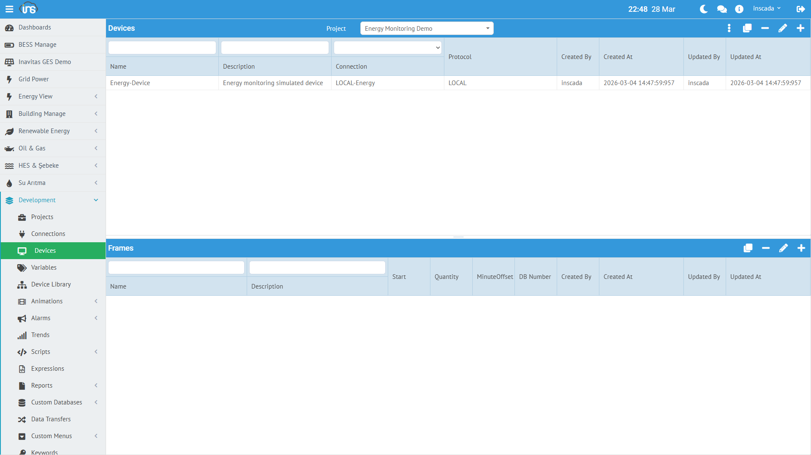

## Device

A device represents a physical or logical unit on a connection. There can be multiple devices under a single connection.

### Creating a Device

**Menu:** Runtime → Connections → Select Connection → Devices → New Device

| Field | Required | Description |
|-------|----------|-------------|
| **Name** | Yes | Device name |
| **Description** | No | Description |
| **Scan Time** | Yes | Read period (ms) |
| **Scan Type** | Yes | Read type (Periodic, OnDemand) |

### Device Structure (Example)

```json
{
  "id": 453,
  "name": "Energy-Device",
  "connectionId": 153,
  "dsc": "Energy monitoring simulated device",
  "scanTime": 2000,
  "scanType": "Periodic"
}
```

| Field | Description |
|-------|-------------|
| **scanTime** | Read period in milliseconds. `2000` = reads every 2 seconds |
| **scanType** | `Periodic` = continuous reading, `OnDemand` = reads only when requested |

### Scan Time Recommendations

| Scenario | Recommended Scan Time |
|----------|----------------------|
| Fast-changing data (power, current) | 1000 - 2000 ms |
| Medium-speed data (temperature, pressure) | 3000 - 5000 ms |
| Slow-changing data (energy meter) | 5000 - 10000 ms |
| Status information (on/off) | 1000 - 3000 ms |

:::tip
The shorter the scan time, the more network traffic increases. Optimize according to your requirements.
:::

---

## Frame (Data Frame)

A frame is a data block read from a device. Each frame defines a specific address range. Variables reside within frames.

### Creating a Frame

**Menu:** Runtime → Connections → Connection → Device → Frames → New Frame

| Field | Required | Description |
|-------|----------|-------------|
| **Name** | Yes | Frame name |
| **Description** | No | Description |
| **Readable** | Yes | Is this frame readable |
| **Writable** | Yes | Can variables in this frame be written to |
| **Scan Time Factor** | No | Device scan time multiplier |
| **Minutes Offset** | No | Timing offset (minutes) |

### Frame Structure (Example)

```json
{
  "id": 703,
  "name": "Energy-Frame",
  "deviceId": 453,
  "dsc": "Energy monitoring frame",
  "isReadable": true,
  "isWritable": true,
  "scanTimeFactor": null,
  "minutesOffset": null
}
```

### Readable / Writable

| Setting | Description |
|---------|-------------|
| **Readable = true** | Frame is read periodically (monitoring) |
| **Writable = true** | Values can be written to variables in this frame (control) |
| **Both = true** | Both read and write (most common) |
| **Readable = false** | Write-only frame (setpoint sending) |

### Scan Time Factor

Sets the frame's read period as a multiple of the device scan time:

- Device scan time = 2000ms, Frame scan time factor = 3 → Frame is read every 6000ms
- `null` or `1` → Read at the same period as the device scan time

:::tip
You can reduce unnecessary network traffic by using scan time factor for frames with slow-changing data.
:::

---

## Hierarchy Summary

```
Connection: LOCAL-Energy (LOCAL, 127.0.0.1)
└── Device: Energy-Device (scanTime: 2000ms, Periodic)
    └── Frame: Energy-Frame (readable + writable)
        ├── ActivePower_kW (Float, kW)
        ├── ReactivePower_kVAR (Float, kVAR)
        ├── Voltage_V (Float, V)
        ├── Current_A (Float, A)
        ├── Frequency_Hz (Float, Hz)
        ├── PowerFactor (Float)
        ├── Energy_kWh (Float, kWh)
        ├── Temperature_C (Float, °C)
        ├── Demand_kW (Float, kW)
        └── GridStatus (Boolean)
```

This structure is the same for a MODBUS connection — the only difference is that protocol-specific parameters (slave ID, start address, register count, etc.) are added.
