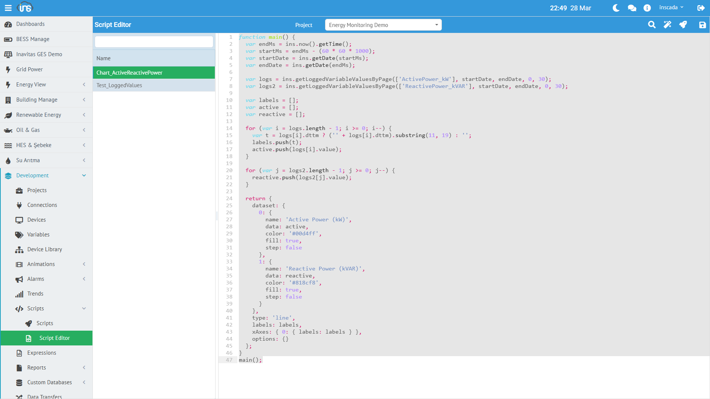

inSCADA, sunucu tarafında çalışan bir JavaScript script motoru içerir. Bu motor sayesinde otomasyon, veri işleme, entegrasyon ve raporlama gibi görevler platforma gömülü scriptlerle gerçekleştirilebilir.

Script engine, **Nashorn** (JDK 11 dahili) JavaScript çalışma ortamını kullanır ve ECMAScript 5 standardını destekler.

## Script Nerede Çalışır?

inSCADA'da script'ler birden fazla yerde kullanılır:

| Kullanım Alanı | Açıklama | Tetikleme |
|----------------|----------|-----------|
| **Zamanlanmış Script** | Bağımsız otomasyon görevi | Periodic, Daily, Once veya manuel |
| **Variable Expression** | Değişken değer dönüşümü | Her poll döngüsünde otomatik |
| **Alarm Expression** | Özel alarm koşulu (Custom Alarm) | Değer değişiminde otomatik |
| **Animation Expression** | SVG animasyon davranışı | Her UI güncellemesinde |
| **MQTT Subscribe/Publish** | Mesaj parse/oluşturma | Her MQTT mesajında |
| **Log Expression** | Özel loglama koşulu | Her poll döngüsünde |

## Zamanlanmış Script'ler (Repeatable Scripts)

Zamanlanmış script'ler, projeye bağlı bağımsız görevlerdir. **Development → Scripts** menüsünden oluşturulur.

### Zamanlama Tipleri

| Tip | Parametreler | Açıklama |
|-----|-------------|----------|
| **Periodic** | Period (ms), Offset (ms) | Sabit aralıkla tekrarlayan çalıştırma |
| **Daily** | Saat:Dakika | Her gün belirli bir saatte |
| **Once** | Gecikme (ms) | Tek seferlik çalıştırma |
| **None** | — | Otomatik zamanlama yok, API ile veya manuel tetiklenir |

### Script Parametreleri

| Parametre | Açıklama |
|-----------|----------|
| **Name** | Script adı (benzersiz) |
| **Code** | JavaScript kaynak kodu |
| **Schedule Type** | Zamanlama tipi |
| **Period / Time** | Zamanlama parametresi |
| **Log** | Script çalıştırma loglarını kaydet |

### Örnek Script Tanımı

REST API'den alınan bir script tanımı:

```json
{
  "id": 159,
  "name": "Chart_ActiveReactivePower",
  "projectId": 153,
  "type": "None",
  "log": false,
  "dsc": null,
  "owner": "inscada",
  "code": "function main() { ... }"
}
```

## ins.* API

Script'ler içinden `ins` nesnesi üzerinden inSCADA platformunun tüm fonksiyonlarına erişilebilir. `ins` nesnesi script çalıştırıldığında otomatik olarak enjekte edilir.

`ins` nesnesi şu API modüllerini içerir:

| Modül | Açıklama | Sayfa |
|-------|----------|-------|
| **Variable API** | Değişken okuma/yazma, loglama | [Detay →](/docs/tr/platform/scripts/variable-api/) |
| **Connection API** | Bağlantı başlatma/durdurma, güncelleme | [Detay →](/docs/tr/platform/scripts/connection-api/) |
| **Alarm API** | Alarm grup yönetimi, geçmiş sorgulama | [Detay →](/docs/tr/platform/scripts/alarm-api/) |
| **Trend API** | Trend tanımları ve tag yönetimi | [Detay →](/docs/tr/platform/scripts/trend-api/) |
| **Utils API** | REST çağrısı, SQL, tarih, format, ping | [Detay →](/docs/tr/platform/scripts/utils-api/) |
| **Notification API** | E-posta, SMS, web bildirim | [Detay →](/docs/tr/platform/scripts/notification-api/) |
| **Script API** | Script zamanlama, global nesne | [Detay →](/docs/tr/platform/scripts/script-api/) |
| **Report API** | Rapor üretme ve gönderme | [Detay →](/docs/tr/platform/scripts/report-api/) |
| **Project API** | Proje bilgileri | [Detay →](/docs/tr/platform/scripts/project-api/) |
| **Log API** | Denetim logu yazma | [Detay →](/docs/tr/platform/scripts/log-api/) |
| **System API** | Sistem fonksiyonları | [Detay →](/docs/tr/platform/scripts/system-api/) |
| **Map API** | GIS harita fonksiyonları | [Detay →](/docs/tr/platform/scripts/map-api/) |
| **Data Transfer API** | Dosya tabanlı veri aktarımı | [Detay →](/docs/tr/platform/scripts/datatransfer-api/) |

### Script Editor



### Temel Kullanım

```javascript
// Değişken değeri okuma
var result = ins.getVariableValue("ActivePower_kW");
ins.consoleLog("Güç: " + result.value + " kW");

// Değişken değeri yazma
ins.setVariableValue("Temperature_C", {value: 55.0});

// REST API çağrısı
var response = ins.rest("GET",
    "https://jsonplaceholder.typicode.com/todos/1",
    "application/json", null);
var data = JSON.parse(response.body);
// → { userId: 1, id: 1, title: "delectus aut autem", completed: false }

// Denetim logu yazma
ins.writeLog("INFO", "Script Test", "Otomasyon görevi tamamlandı");

// Global nesne paylaşımı (script'ler arası)
ins.setGlobalObject("shift_data", {shift: "A", count: 150});
var data = ins.getGlobalObject("shift_data");
// → { shift: "A", count: 150 }
```

## Sandbox Ortamı

Script'ler izole bir sandbox ortamında çalışır:
- **Sınırlı classpath** — yalnızca izin verilen Java sınıflarına erişim
- **Proje bazlı izolasyon** — her script kendi projesinin kapsamında çalışır
- **Hata yakalama** — script hatası platformu etkilemez

:::caution
Script'ler sunucu tarafında çalışır. Sonsuz döngü veya çok ağır hesaplamalar platform performansını olumsuz etkileyebilir. Script'lerinizi mümkün olduğunca verimli tutun.
:::
