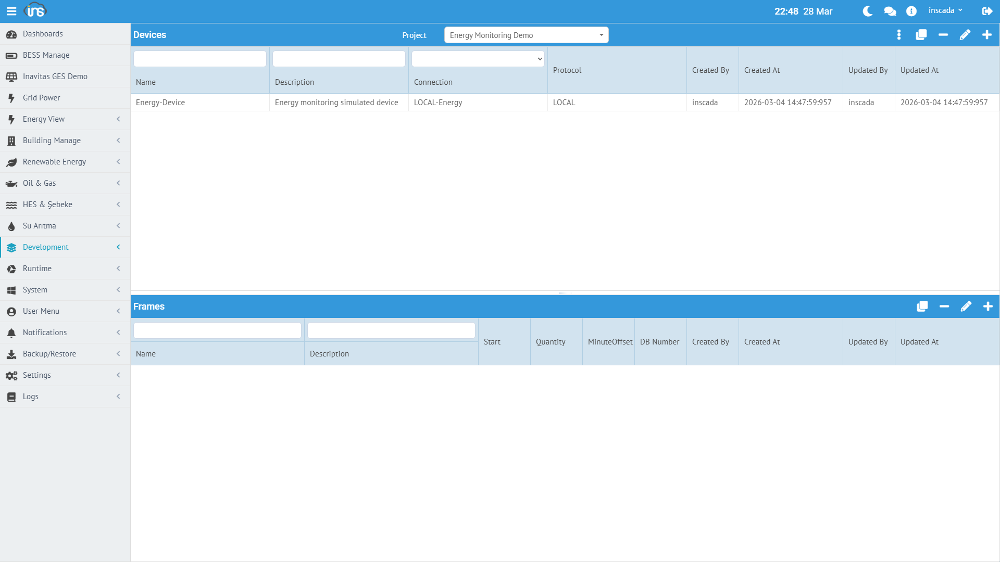

A variable is the most fundamental data unit in inSCADA. A temperature measurement, a motor status, an energy meter — each one is a variable.



## Creating a Variable

**Menu:** Runtime → Variables → New Variable

| Field | Required | Description |
|-------|----------|-------------|
| **Name** | Yes | Variable name (unique within the project) |
| **Type** | Yes | Data type |
| **Unit** | No | Engineering unit (°C, kW, V, A, bar...) |
| **Description** | No | Description |
| **Connection / Device / Frame** | Yes | Which connection it belongs to |
| **Active** | Yes | Active/inactive |

## Data Types

| Type | Description | Example |
|------|-------------|---------|
| **Float** | Decimal number | 25.4, 230.1, 0.95 |
| **Integer** | Whole number | 100, -5, 0 |
| **Boolean** | True/False | true, false |
| **String** | Text | "Recipe-A", "Running" |

## Variable Structure (Example)

```json
{
  "id": 23227,
  "name": "ActivePower_kW",
  "dsc": "Total active power",
  "type": "Float",
  "unit": "kW",
  "projectId": 153,
  "connectionId": 153,
  "deviceId": 453,
  "frameId": 703,
  "isActive": true,
  "fractionalDigitCount": 2,
  "engZeroScale": 0.0,
  "engFullScale": 1000.0,
  "logType": "Periodically",
  "logPeriod": 10,
  "keepLastValues": true,
  "valueExpressionType": "CUSTOM",
  "valueExpressionCode": "var t = new Date().getTime() / 1000; return (Math.sin(t / 60) * 150 + 450 + Math.random() * 30).toFixed(2) * 1;"
}
```

---

## Scaling

The raw value is converted to the engineering value through linear transformation.

| Parameter | Description |
|-----------|-------------|
| **engZeroScale** | Engineering unit lower limit |
| **engFullScale** | Engineering unit upper limit |
| **rawZeroScale** | Raw value lower limit |
| **rawFullScale** | Raw value upper limit |

### Conversion Formula

```
Eng = engZeroScale + (raw - rawZeroScale) ×
      (engFullScale - engZeroScale) / (rawFullScale - rawZeroScale)
```

### Example: 4-20mA Sensor → 0-100°C

| Parameter | Value |
|-----------|-------|
| rawZeroScale | 4 (mA) |
| rawFullScale | 20 (mA) |
| engZeroScale | 0 (°C) |
| engFullScale | 100 (°C) |

- Raw: 4mA → Eng: 0°C
- Raw: 12mA → Eng: 50°C
- Raw: 20mA → Eng: 100°C

### Scaling in Real-Time Value Response

```json
{
  "value": 359.91,
  "extras": { "raw_value": 606.56 },
  "flags": { "scaled": true }
}
```

`value` is the scaled engineering value, `extras.raw_value` is the raw value.

---

## Logging (Historical Data)

Variable values can be recorded to the time series database.

### Logging Types

| Type | Description |
|------|-------------|
| **Periodically** | Records at fixed intervals (`logPeriod` seconds) |
| **When Changed** | Records only when the value changes |
| **None** | No recording |

### Logging Parameters

| Parameter | Description |
|-----------|-------------|
| **logPeriod** | Recording period (seconds). `10` = every 10 seconds |
| **logThreshold** | Minimum change threshold (optional). Filters out small fluctuations |
| **logMinValue / logMaxValue** | Valid value range. Values outside this range are not logged |
| **keepLastValues** | Keep the last values list in memory |

### Fractional Digit Count

`fractionalDigitCount` determines the number of decimal places to display:

| Value | Display |
|-------|---------|
| `0` | 350 |
| `1` | 350.5 |
| `2` | 350.48 |
| `3` | 350.483 |

---

## Value Expression

A custom JavaScript formula can be assigned to a variable. This formula runs on every read cycle, and its result becomes the variable's value.

### Expression Types

| Type | Description |
|------|-------------|
| **NONE** | No expression, raw value is used |
| **CUSTOM** | Inline JavaScript code |
| **REFERENCE** | Shared Expression reference (space level) |

### Example: Simulation

```javascript
// Sine wave (ActivePower_kW)
var t = new Date().getTime() / 1000;
return (Math.sin(t / 60) * 150 + 450 + Math.random() * 30).toFixed(2) * 1;
```

### Example: Unit Conversion

```javascript
// Fahrenheit → Celsius
var fahrenheit = value; // raw value
return ((fahrenheit - 32) * 5 / 9).toFixed(1) * 1;
```

### Example: Conditional Logic

```javascript
// Calculate efficiency from two variables
var input = ins.getVariableValue("Input_kW").value;
var output = ins.getVariableValue("Output_kW").value;
if (input > 0) {
    return ((output / input) * 100).toFixed(1) * 1;
}
return 0;
```

---

## Pulse Feature

Pulse mode can be assigned to Boolean variables:

| Parameter | Description |
|-----------|-------------|
| **isPulseOn** | ON pulse active |
| **pulseOnDuration** | ON pulse duration (ms) |
| **isPulseOff** | OFF pulse active |
| **pulseOffDuration** | OFF pulse duration (ms) |

Pulse mode is used for momentary command sending (e.g., motor start button — ON when pressed, automatically OFF when released).

---

## Write Limits

| Parameter | Description |
|-----------|-------------|
| **setMinValue** | Minimum writable value |
| **setMaxValue** | Maximum writable value |

When these parameters are set, write commands outside the range are rejected. Used to prevent operator errors.

---

## Managing Variables with Scripts

```javascript
// Read real-time value
var val = ins.getVariableValue("ActivePower_kW");
// → { value: 359.91, extras: { raw_value: 606.56 }, dateInMs: ... }

// Bulk read
var vals = ins.getVariableValues(["ActivePower_kW", "Voltage_V", "Current_A"]);

// Write value
ins.setVariableValue("Temperature_C", {value: 55.0});

// Variable information
var info = ins.getVariable("ActivePower_kW");
// → { name: "ActivePower_kW", unit: "kW", type: "Float", logPeriod: 10 ... }
```

Detailed API: [Variable API →](/docs/tr/platform/scripts/variable-api/) | [REST API →](/docs/tr/api/variables/)
