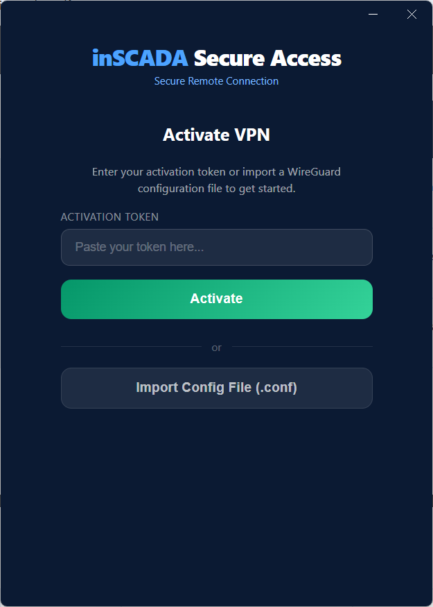
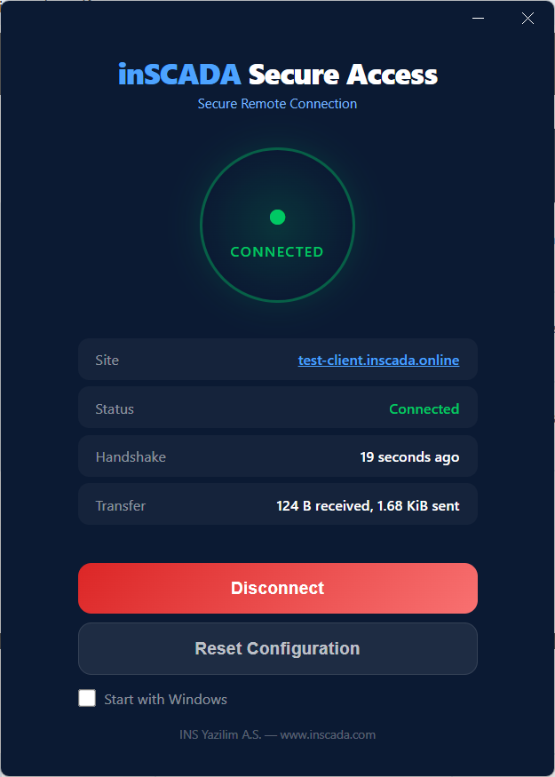
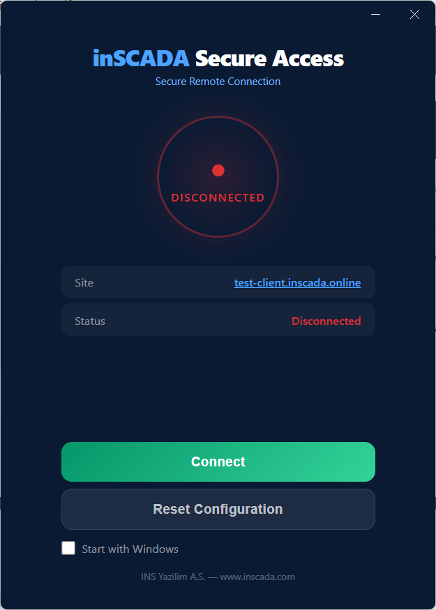

inSCADA Secure Access is a VPN solution that provides secure remote access to your industrial facilities from anywhere. It uses the WireGuard protocol for encrypted, fast, and reliable connections. Connect with a single click using the Windows desktop application — no complex VPN configurations needed.

## Features

- **WireGuard VPN** — Low latency, high performance. Much faster than traditional VPN solutions
- **One-click setup** — Paste your token, connect. No complex configuration needed
- **Custom access address** — Dedicated subdomain for each customer: `yourcompany.inscada.online`
- **Connection monitoring** — View status, uptime, and transfer data in real time
- **Auto-reconnect** — Automatically reconnects when the connection drops
- **Start with Windows** — VPN connection ready when your computer starts

## Getting Started

### 1. Select a Plan

Choose a Basic or Pro plan at [vpn.inscada.online](https://vpn.inscada.online). Your VPN infrastructure is automatically provisioned after payment.

### 2. Download the Application

Download and install **inSCADA Secure Access** from [inscada.com/download](https://inscada.com/download/).

**Requirements:** Windows 10/11

### 3. Activation

Open the application and paste the **activation token** sent to you, then click Activate. Your VPN configuration is loaded automatically.

Alternatively, you can import a WireGuard `.conf` file using the **Import Config File** button.

### 4. Connect

Click the Connect button. Securely access your facility at `yourcompany.inscada.online`.

## Application Interface

The application operates in three main states:

| State | Description |
|-------|-------------|
| **Disconnected** | VPN connection is off. Click Connect to establish connection |
| **Connecting** | Connection is being established |
| **Connected** | VPN is active. Site address, handshake time, and transfer data are visible |

When connected, the following information is displayed:
- **Site** — Your facility's access address (e.g. `test-client.inscada.online`)
- **Status** — Connection status
- **Handshake** — Time since last successful handshake
- **Transfer** — Amount of data sent and received

### Additional Features

- **Start with Windows** — Check this option to launch the application automatically with Windows
- **Reset Configuration** — Resets the current VPN configuration. Requires re-activation
- **System tray** — The application continues running in the system tray when closed

## Use Cases

- **SCADA maintenance & updates** — Update your SCADA software remotely, change parameters without visiting the site
- **Emergency response** — Connect to your facility from home when an alarm notification arrives and diagnose the issue instantly
- **Remote site monitoring** — Monitor geographically distributed facilities from a single point
- **Multi-site management** — Manage all your facilities from a single panel

## Comparison with Traditional Solutions

| Criteria | inSCADA Secure Access | Traditional VPN |
|----------|----------------------|-----------------|
| Setup time | Minutes | Hours/Days |
| Custom access address | yourcompany.inscada.online | Access via IP address |
| Connection performance | WireGuard (low latency) | OpenVPN/IPSec (high latency) |
| Auto-reconnect | Yes | Usually not available |
| Management panel | Web-based admin panel | Command line / manual |

## Security

- All traffic is end-to-end encrypted with WireGuard
- VPN configuration is stored securely on the local machine
- Separate key pairs are generated for each site
- Activation tokens are single-use

## Support

Contact us at [inscada.com/contact](https://inscada.com/contact/) or create a support ticket from the [vpn.inscada.online](https://vpn.inscada.online) admin panel.
