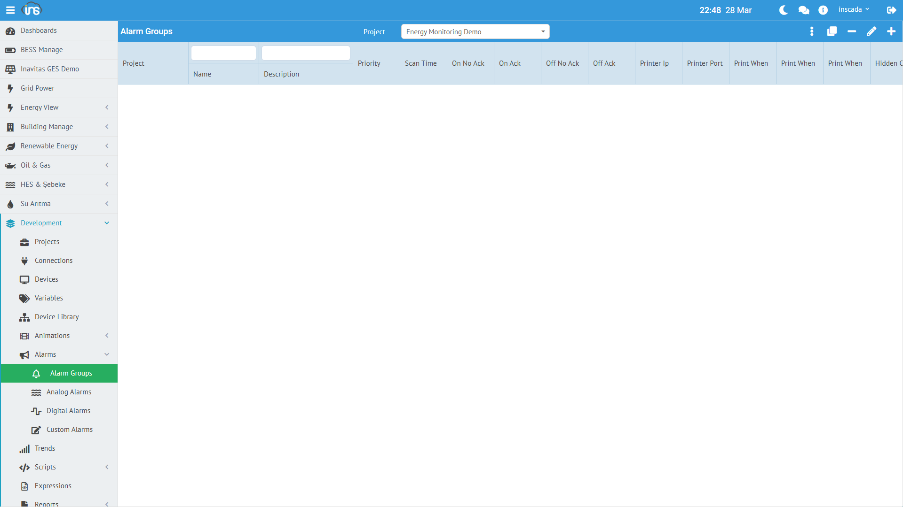
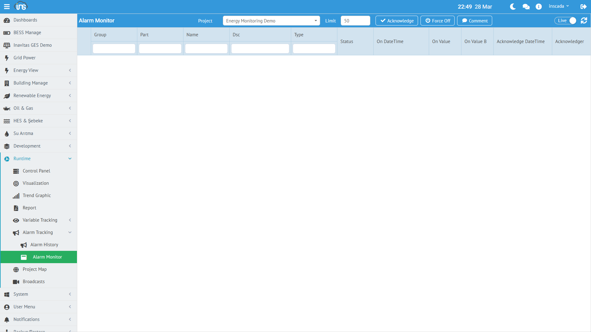

Alarm sistemi, değişken değerlerindeki anormal durumları tespit eder, kaydeder ve bildirir. Alarmlar grup halinde organize edilir ve her grup bir projeye bağlıdır.



## Alarm Grubu

Alarm grubu, alarm tanımlarını organize eden ve ortak davranış parametreleri belirleyen konteynerdir.

### Alarm Grubu Oluşturma

**Menü:** Runtime → Alarms → Alarm Groups → Yeni Grup

| Alan | Zorunlu | Açıklama |
|------|---------|----------|
| **Name** | Evet | Grup adı |
| **Scan Time (ms)** | Evet | Alarm kontrol periyodu (min: 100ms) |
| **Priority** | Evet | Öncelik seviyesi (1-255) |
| **Description** | Hayır | Açıklama |

### Alarm Grubu Gelişmiş Ayarlar

| Alan | Açıklama |
|------|----------|
| **On Script** | Alarm tetiklendiğinde çalışacak script |
| **Off Script** | Alarm kapandığında çalışacak script |
| **Ack Script** | Alarm onaylandığında çalışacak script |
| **On (No Ack) Color** | Tetiklendi, onaylanmadı rengi |
| **On (Ack) Color** | Tetiklendi, onaylandı rengi |
| **Off (No Ack) Color** | Kapandı, onaylanmadı rengi |
| **Off (Ack) Color** | Kapandı, onaylandı rengi |
| **Hidden on Monitor** | Alarm monitöründe gizle |

### Yazıcı Entegrasyonu

Alarm olayları doğrudan ağ yazıcısına gönderilebilir:

| Alan | Açıklama |
|------|----------|
| **Printer IP** | Yazıcı IP adresi |
| **Printer Port** | Yazıcı port numarası |
| **Print When On** | Tetiklendiğinde yazdır |
| **Print When Off** | Kapandığında yazdır |
| **Print When Ack** | Onaylandığında yazdır |

---

## Alarm Tipleri

### Analog Alarm

Sayısal değişkenlerin eşik değerlerini izler.

| Eşik | Açıklama | Örnek |
|------|----------|-------|
| **High-High** | Çok yüksek (kritik) | Sıcaklık > 90°C |
| **High** | Yüksek (uyarı) | Sıcaklık > 70°C |
| **Low** | Düşük (uyarı) | Basınç < 2 bar |
| **Low-Low** | Çok düşük (kritik) | Basınç < 1 bar |

Her eşik için ayrı ayrı alarm tanımı oluşturulur. Hysteresis (gecikme bandı) değeri ile alarm titreşimi önlenir.

### Digital Alarm

Boolean değişkenlerin durum değişimini izler.

| Koşul | Açıklama |
|-------|----------|
| **ON = Alarm** | Değer `true` olduğunda alarm tetiklenir |
| **OFF = Normal** | Değer `false` olduğunda alarm kapanır |

Örnek: Motor arıza sinyali, kapı açık kontağı, acil stop butonu.

### Custom Alarm

JavaScript expression ile özel alarm koşulu tanımlama.

```javascript
// Birden fazla değişkene bağlı alarm koşulu
var power = ins.getVariableValue("ActivePower_kW").value;
var temp = ins.getVariableValue("Temperature_C").value;
return power > 500 && temp > 70; // her ikisi de yüksekse alarm
```

---

## Alarm Yaşam Döngüsü

```
Normal → Fired (Tetiklendi) → Acknowledged (Onaylandı) → Off (Kapandı)
```

### Durum Geçişleri

| Geçiş | Tetikleyen | Açıklama |
|-------|-----------|----------|
| Normal → **Fired** | Sistem | Alarm koşulu sağlandı |
| Fired → **Acknowledged** | Operatör | Operatör alarmı onayladı |
| Fired/Ack → **Off** | Sistem | Alarm koşulu ortadan kalktı |
| Fired → **Force Off** | Operatör | Alarm zorla kapatıldı |

### Alarm Renk Kodları

| Durum | Varsayılan | Anlamı |
|-------|-----------|--------|
| Fired + No Ack | Kırmızı yanıp söner | Dikkat gerekli |
| Fired + Ack | Kırmızı sabit | Farkında, devam ediyor |
| Off + No Ack | Sarı | Kapandı ama görülmedi |
| Off + Ack | Normal | Tamamlandı |

---

## Alarm İzleme

### Alarm Monitor

**Menü:** Runtime → Alarm Tracking → Alarm Monitor



Aktif alarmları gerçek zamanlı olarak gösterir. Operatör bu ekrandan:
- Alarmları görüntüler
- Alarmları onaylar (Acknowledge)
- Alarmları zorla kapatır (Force Off)

### Alarm Tracking

**Menü:** Visualization → Alarm Tracking

Alarm geçmişini tarih aralığına göre sorgular. Her alarm kaydı:

| Alan | Açıklama |
|------|----------|
| Alarm adı | Hangi alarm tetiklendi |
| Tetiklenme zamanı | Ne zaman tetiklendi |
| Kapanma zamanı | Ne zaman kapandı |
| Onaylayan | Kim onayladı |
| Süre | Ne kadar sürdü |
| Değer | Tetiklenme anındaki değer |

---

## Script ile Alarm Yönetimi

```javascript
// Son tetiklenen alarmlar
var alarms = ins.getLastFiredAlarms(0, 10);
// → [] (aktif alarm yoksa boş dizi)

// Tarih aralığında alarm geçmişi
var end = ins.now();
var start = ins.getDate(end.getTime() - 86400000);
var history = ins.getLastFiredAlarmsByDate(start, end, true, 100);

// Alarm grubunu devre dışı bırak (bakım modu)
ins.deactivateAlarmGroup("Temperature_Alarms");

// Bakım sonrası tekrar etkinleştir
ins.activateAlarmGroup("Temperature_Alarms");
```

Detaylı API: [Alarm API →](/docs/tr/platform/scripts/alarm-api/) | [REST API →](/docs/tr/api/alarms/)
