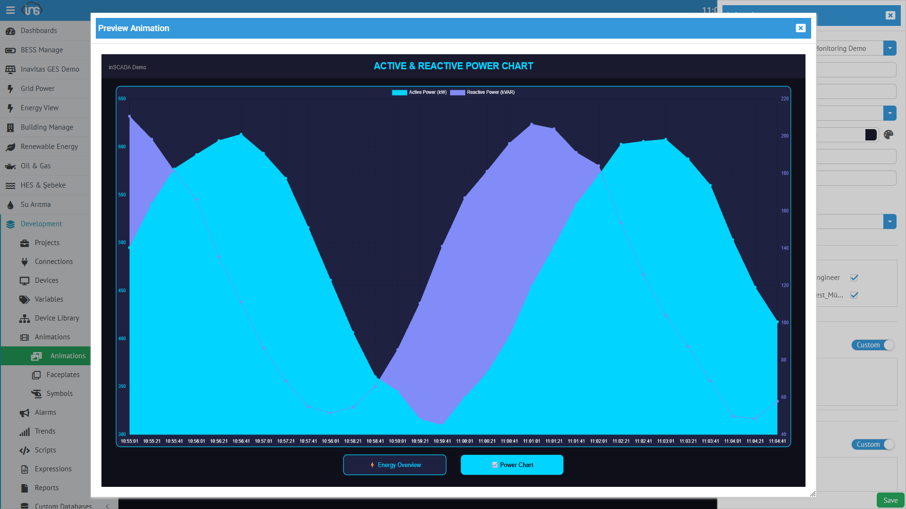

## Chart (Grafik)

**Chart**, SVG ekran içine interaktif grafik bileşeni yerleştirir. Tarihsel veri veya anlık değer serilerini görselleştirir.



### Kullanım

| Alan | Değer |
|------|-------|
| **Type** | Chart |
| **Uygun SVG Öğeleri** | `<rect>` (foreignObject olarak dönüştürülür) |
| **Expression Type** | Collection, Expression |

### Grafik Tipleri

| Tip | Kullanım |
|-----|----------|
| **line** | Zaman serisi, trend takibi |
| **bar** | Karşılaştırma, periyodik özet |
| **area** | Kümülatif değerler, alan grafiği |
| **pie** | Dağılım gösterimi |

### Yapılandırma (Props)

| Özellik | Açıklama |
|---------|----------|
| **type** | Grafik tipi (line, bar, area, pie) |
| **colors** | Seri renkleri |
| **xAxis** | X ekseni ayarları |
| **yAxis** | Y ekseni ayarları |
| **legend** | Açıklama göster/gizle |

### Expression Örneği — Tarihsel Veri Grafiği

```javascript
var endMs = ins.now().getTime();
var startMs = endMs - (60 * 60 * 1000); // Son 1 saat

var logs = ins.getLoggedVariableValuesByPage(
    Java.to(['ActivePower_kW'], 'java.lang.String[]'),
    ins.getDate(startMs), ins.getDate(endMs), 0, 30
);
var logs2 = ins.getLoggedVariableValuesByPage(
    Java.to(['ReactivePower_kVAR'], 'java.lang.String[]'),
    ins.getDate(startMs), ins.getDate(endMs), 0, 30
);

var labels = [];
var active = [];
var reactive = [];

for (var i = logs.length - 1; i >= 0; i--) {
    labels.push(logs[i].dttm);
    active.push(logs[i].value);
}
for (var j = logs2.length - 1; j >= 0; j--) {
    reactive.push(logs2[j].value);
}

return {
    type: 'area',
    labels: labels,
    dataset: {
        0: {
            name: 'Active Power (kW)',
            data: active,
            color: '#00d4ff',
            fill: true
        },
        1: {
            name: 'Reactive Power (kVAR)',
            data: reactive,
            color: '#818cf8',
            fill: true
        }
    },
    xAxes: { 0: { labels: labels } },
    options: {}
};
```

Bu örnek yukarıdaki Preview Animation screenshot'ındaki grafiği oluşturur.

### Expression Örneği — Anlık Dağılım (Pie)

```javascript
var power = ins.getVariableValue("ActivePower_kW").value;
var reactive = ins.getVariableValue("ReactivePower_kVAR").value;

return {
    type: 'pie',
    dataset: {
        0: { name: 'Aktif', data: [power], color: '#3498db' },
        1: { name: 'Reaktif', data: [reactive], color: '#e74c3c' }
    }
};
```

---

## Peity (Sparkline Mini Grafik)

**Peity**, küçük inline sparkline grafik oluşturur. Metin yanında kompakt trend gösterimi — fazla yer kaplamadan değerin yönünü görselleştirir.

### Kullanım

| Alan | Değer |
|------|-------|
| **Type** | Peity |
| **Uygun SVG Öğeleri** | `<rect>` (foreignObject) |
| **Expression Type** | Collection |

### Peity Tipleri

| Tip | Görünüm |
|-----|---------|
| **line** | Çizgi sparkline |
| **bar** | Mini çubuk grafik |
| **pie** | Mini pasta grafik |
| **donut** | Mini halka grafik |

### Kullanım Senaryosu

Değişken değerinin yanına son 10 değerin mini trend grafiğini eklemek:

```xml
<g transform="translate(200, 30)">
  <text id="power_value" font-size="20">350 kW</text>
  <foreignObject id="power_sparkline" x="100" y="-10" width="80" height="25"/>
</g>
```

- `power_value` → Get, Tag: `ActivePower_kW`
- `power_sparkline` → Peity, son 10 değer ile line sparkline

---

## Datatable (Tablo)

**Datatable**, SVG ekran içine interaktif tablo yerleştirir. Webix datatable bileşeni olarak çalışır.

### Kullanım

| Alan | Değer |
|------|-------|
| **Type** | Datatable |
| **Uygun SVG Öğeleri** | `<rect>` (foreignObject) |
| **Expression Type** | Collection, Expression |

### Yapılandırma (Props)

| Özellik | Açıklama |
|---------|----------|
| **columns** | Kolon tanımları (başlık, genişlik, format) |
| **autoheight** | Otomatik yükseklik |
| **select** | Satır seçimi |

### Expression Örneği — Değişken İzleme Tablosu

```javascript
var names = ["ActivePower_kW", "Voltage_V", "Current_A", "Frequency_Hz"];
var rows = [];
for (var i = 0; i < names.length; i++) {
    var val = ins.getVariableValue(names[i]);
    rows.push({
        name: names[i],
        value: val.value.toFixed(2),
        unit: val.variableShortInfo.dsc,
        time: new Date(val.dateInMs).toLocaleTimeString()
    });
}
return rows;
```
