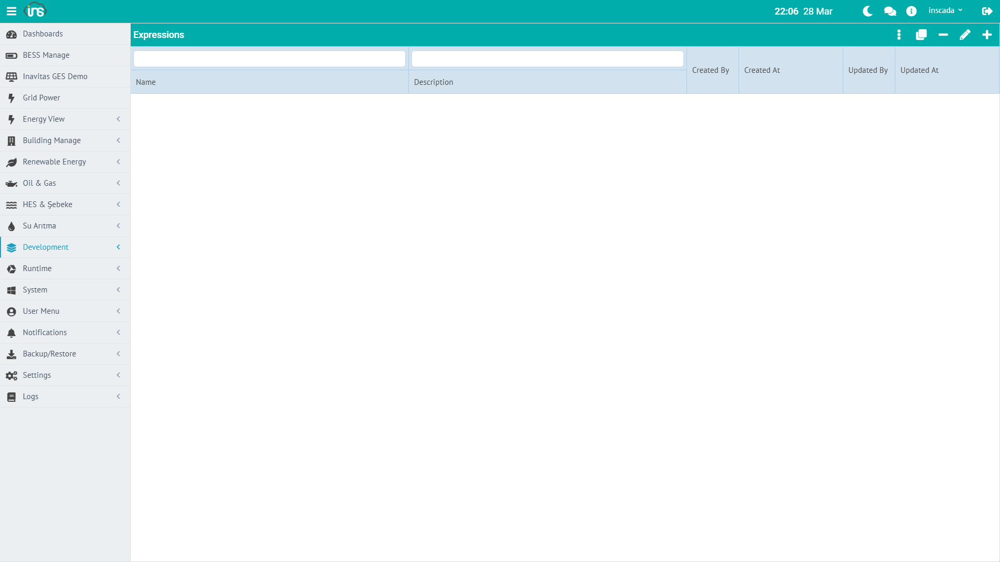

The Animation Element Editor is the editor used to visually select objects on the SVG screen and bind animation behaviors to the selected objects. SCADA screens are quickly created through a visual configuration interface without writing code.



## Accessing the Editor

**Menu:** Development → Animations → Animation Dev → **Element Editor** button in the upper right corner

The editor opens as a panel next to the SVG screen.

---

## Workflow

### Step 1: Selecting an Object on the SVG

You select an object by **clicking with the mouse** on the SVG open in the Animation Dev screen. The selected object is visually highlighted.

#### Accessing Objects Inside Groups

Objects in SVG are usually grouped within `<g>` (group) elements. The default click selects the top-level group.

**To access an object inside a group:**

1. Press and release the **Ctrl** key once
2. Now when you click with the mouse, the **object you directly clicked on** is selected instead of the group
3. This allows you to target inner objects like text, rect, circle within a group

:::tip
Ctrl mode returns to normal mode after one click. Press Ctrl again if you want to select another inner object.
:::

### Step 2: Opening the Element Editor

Click the **Element Editor** button while an object is selected. When the editor opens:

- The selected object's **DOM ID** is automatically retrieved
- Based on the object's SVG tag type (text, rect, g, image, circle, path...), the **applicable animation types** are automatically filtered
- Appropriate animation types are displayed as tabs ready for configuration

#### Available Animation Types by SVG Tag Type

| SVG Tag | Available Types |
|---------|----------------|
| **text / tspan** | Get, Color, Opacity, Visibility, Rotate, Move, Scale, Bar, Pipe, Blink, Tooltip, AlarmIndication, Click |
| **rect / circle / ellipse / polygon** | In addition to the above: Chart, Iframe, Datatable, Slider, Input, QRCode, GetSymbol, Faceplate, Peity, Menu, Button, Image |
| **g (group)** | Animate, Faceplate, Iframe, Rotate, Move, Scale, Opacity, Visibility |
| **image** | Faceplate, Iframe, Image |

### Step 3: Selecting and Configuring an Animation Type

Select the desired animation type from the tabs. Each animation type has its **own visual configuration interface**:

#### Visual Configuration Without Writing Code

Each animation type comes with form fields appropriate to its type. The developer configures by filling in these form fields **without writing code**:

| Animation Type | Configuration Interface |
|---------------|------------------------|
| **Get** | Variable selector, format setting, unit |
| **Color** | Color palette, condition table (value → color mapping) |
| **Rotate** | Rotation center (cx, cy), min/max angle, min/max value |
| **Bar** | Direction (horizontal/vertical), min/max value, fill color |
| **Move** | Axis (X/Y), distance range, min/max value |
| **Slider** | Min, max, step, direction, color |
| **Chart** | Chart type, colors, axis settings, data source |
| **Opacity** | Min/max opacity, min/max value |
| **Visibility** | Condition (Boolean or threshold) |
| **Blink** | Blink speed, colors |
| **Set** | Target variable, value to write |
| **Input** | Type (text/number), min, max, placeholder |
| **Iframe** | URL address |
| **Open** | Target animation selector |
| **Faceplate** | Faceplate selector, placeholder values |
| **Datatable** | Column definitions, data source |
| **AlarmIndication** | Alarm group selector |

### Step 4: Expression (Advanced — Optional)

Each animation type has an **Expression** section. This section is optional — you don't need to use it if the visual configuration is sufficient.

Expression allows the developer to program the animation behavior in a completely freeform manner:

#### Expression Types

| Type | Description | When to Use |
|------|-------------|-------------|
| **Tag** | Variable name reference | Simplest — directly binding a variable |
| **Expression** | JavaScript code | Calculation, formatting, conditional logic |
| **Switch** | Value → result table | State-based multiple matching |
| **Numeric** | Constant number | For testing purposes |
| **Text** | Constant text | Label, heading |
| **Collection** | Multiple variables | For Chart, Datatable |
| **Alarm** | Alarm reference | For AlarmIndication |
| **Faceplate** | Faceplate reference | Faceplate placement |
| **Animation** | Animation reference | Screen navigation (Open) |
| **Animation Popup** | Popup reference | Open modal screen |
| **Custom Menu** | Menu reference | Open menu |
| **Url** | URL | Iframe embedding |
| **Tetra Color** | 4-color alarm status | Alarm color codes |
| **Button** | Button configuration | Button type |
| **Html** | HTML content | Rich content |
| **System Page** | System page | Platform internal page |
| **InSCADA View** | Platform view | Internal view |

#### Expression Examples

**Tag** — Simply write the variable name:
```
ActivePower_kW
```

**Expression** — Free calculation with JavaScript:
```javascript
// Formatted value
var val = ins.getVariableValue("ActivePower_kW");
return val.value.toFixed(1) + " kW";
```

```javascript
// Conditional color
var temp = ins.getVariableValue("Temperature_C").value;
if (temp > 80) return "#ff0000";
if (temp > 60) return "#ff8800";
return "#00cc00";
```

```javascript
// Calculation from two variables
var power = ins.getVariableValue("ActivePower_kW").value;
var voltage = ins.getVariableValue("Voltage_V").value;
if (voltage > 0) return (power * 1000 / voltage).toFixed(1);
return "0";
```

**Switch** — Value → result matching table:
```
0 → Stopped
1 → Running
2 → Fault
3 → Maintenance
```

Color switch:
```
true → #00cc00
false → #ff0000
```

### Step 5: Saving

| Button | Function |
|--------|----------|
| **Save** | Saves the animation element. The binding is attached to the object |
| **Run & Save** | First tests the expression on the server, saves if the result is successful |

**Run & Save** is especially useful when developing expressions — you verify the result before saving.

After saving, the binding automatically becomes active when the animation is run in Visualization mode.

---

## Runtime Architecture

The bindings configured in the Element Editor work as follows in the Visualization screen:

### WebSocket-Based Real-Time Update

```
┌─────────────┐                    ┌──────────┐                  ┌─────────┐
│   Browser   │──eval-animation──▶│  Server  │◀── Variable ────│  Cache  │
│  (SVG DOM)  │◀─anim-results────│  (Engine) │    Values       │         │
└──────┬──────┘                    └──────────┘                  └─────────┘
       │
       ▼
  For each element
  type-appropriate
  DOM update
```

### Flow

1. **Visualization opens** → Animation elements are loaded, WebSocket subscription is established
2. **Every `duration` ms** → Browser sends an `eval-animation` message
3. **Server** → Runs all element expressions, reads variable values from cache
4. **Result returns** → Calculated value for each element ID
5. **DOM is updated** → Appropriate DOM operation is applied based on each element type

### DOM Update Table

| Animation Type | DOM Operation |
|---------------|--------------|
| **Get** | `element.textContent = value` |
| **Color** | `element.style.fill = color` |
| **Opacity** | `element.style.opacity = value` |
| **Visibility** | `element.style.display = value ? '' : 'none'` |
| **Rotate** | `transform: rotate(angle)` |
| **Move** | `transform: translate(x, y)` |
| **Bar** | `element.height = value` or `element.width = value` |
| **Scale** | `transform: scale(value)` |
| **Blink** | SVG `<animate>` element add/remove |
| **Pipe** | `stroke-dashoffset` animation |

### Control Elements (Set, Slider, Input, Click)

Control types are **not included** in periodic evaluation. They are triggered on user interaction:

```
User Click → Run Expression → ins.setVariableValue() → Cache → Field Device
```

### Performance

- All elements are evaluated in bulk in a **single WebSocket message**
- Variable values are read **from cache** (no database access, < 1ms)
- Only **active** elements (`status: true`) are evaluated
- **Event-based** elements like Click, MouseDown are excluded from the periodic cycle
- Timeout: if no response arrives within `duration × 10` ms, a retry is attempted

:::caution
Control elements call `ins.setVariableValue()` on the server side. The user must have `SET_VARIABLE_VALUE` permission.
:::
