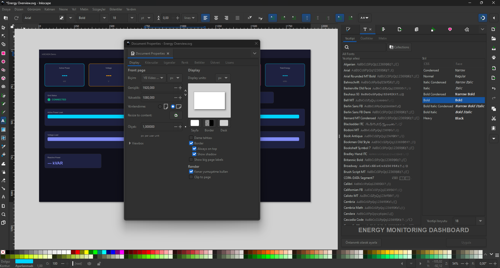

SVG Animation is the core visualization component of inSCADA. Each animation consists of an SVG file and creates real-time SCADA screens by binding to variable values.


## Screen Development Process

Creating a SCADA screen consists of three steps:

### 1. SVG Design (External Editor)

The SVG screen is designed using any SVG editor. **Inkscape** (free, open source) is the recommended editor.



During design:
- Freely create the visual layout of the screen — device symbols, text fields, buttons, indicators, charts
- **You don't need to worry about SVG IDs** — inSCADA automatically scans the entire SVG tree and makes every object selectable
- Use standard SVG elements: `<rect>`, `<circle>`, `<text>`, `<path>`, `<g>`, `<image>`
- You can create designs as complex as you like — layers, groups, gradients, filters

### Document Properties (Page Settings)

In Inkscape, set the page size under **File → Document Properties**:

| Setting | Recommended Value | Description |
|---------|-------------------|-------------|
| **Width** | 1920 px | Full HD screen width |
| **Height** | 1080 px | Full HD screen height |
| **Unit** | px | Pixel unit |
| **Scale** | 1.0 | 1:1 scale |
| **Orientation** | Landscape | SCADA screens are typically landscape |

:::caution[Background Color]
The background color set in Inkscape is **not transferred** to inSCADA. The background color is set from the **Color** field in the animation's configuration panel in inSCADA. Use the Inkscape background only as a visual reference during design.
:::

### 2. SVG Upload (Animation Dev)

Upload the designed SVG file to the platform:

**Menu:** Development → Animations → Animation Dev


Create a new animation or update the SVG content of an existing animation. Once the SVG file is uploaded, it is visualized on the screen.

### 3. Animation Binding (Element Editor)

After the SVG is uploaded, you bind animation behaviors to each object by **clicking on objects with the mouse** on the screen:

1. **Click on an object** on the SVG with the mouse — the object is selected and highlighted
2. Click the **Element Editor** (magic wand icon) button in the upper right
3. The applicable animation types are automatically listed based on the selected object's type
4. Select and configure the desired animation type
5. **Save** to save


After these three steps, the SVG screen updates with live SCADA data when you run it in the Visualization screen.

Detailed information: [Element Editor →](/docs/tr/platform/animations/element-editor/)

### Preview

You can preview the animation live by clicking the rocket icon:


### Animation Configuration

You can edit the animation's settings by clicking the pencil icon — Duration, Play Order, Main, Color, Alignment, access roles, and Pre/Post scripts:


Detailed information: [Animation Configuration →](/docs/tr/platform/animations/configuration/)

## Animation Structure

Each animation consists of three components:

```
Animation
├── SVG Content (the uploaded SVG file)
├── Animation Elements (behaviors bound to objects selected with the mouse)
│   ├── Element 1: temperature text → Temperature_C (Get)
│   ├── Element 2: motor indicator → MotorStatus (Color)
│   └── Element 3: valve group → ValvePosition (Rotate)
└── Animation Scripts (code that runs every scan cycle)
    ├── Pre-Animation Code
    └── Post-Animation Code
```

## Animation Elements

An Animation Element is a behavior definition bound to an object selected with the mouse on the SVG. When you click on an object and open the Element Editor, the following fields are automatically filled or configured:

| Field | Description |
|-------|-------------|
| **DOM ID** | The ID of the selected SVG object (automatically retrieved — no need to enter manually) |
| **Type** | Animation type — appropriate types are automatically listed based on the object type |
| **Expression Type** | How the value is calculated (Tag, Expression, Switch, etc.) |
| **Expression** | Value expression (variable name, formula, or configuration) |
| **Props** | Type-specific additional settings (each type presents its own visual form) |
| **Status** | Active/inactive |

### Animation Types

inSCADA supports **36 different animation types**:

#### Data Display

| Type | Description | Page |
|------|-------------|------|
| **Get** | Display variable value as text | [Details →](/docs/tr/platform/animations/get/) |
| **Color** | Change element color based on value | [Details →](/docs/tr/platform/animations/color/) |
| **Bar** | Bar height/width based on value | [Details →](/docs/tr/platform/animations/bar-scale/) |
| **Opacity** | Opacity based on value | [Details →](/docs/tr/platform/animations/opacity-visibility-blink/) |
| **Visibility** | Show/hide based on condition | [Details →](/docs/tr/platform/animations/opacity-visibility-blink/) |
| **Rotate** | Rotation based on value | [Details →](/docs/tr/platform/animations/rotate-move/) |
| **Move** | X/Y translation based on value | [Details →](/docs/tr/platform/animations/rotate-move/) |
| **Scale** | Scaling based on value | [Details →](/docs/tr/platform/animations/bar-scale/) |
| **Blink** | Blinking based on condition | [Details →](/docs/tr/platform/animations/opacity-visibility-blink/) |
| **Pipe** | Pipe/line flow animation | [Details →](/docs/tr/platform/animations/pipe-tooltip-image/) |
| **Tooltip** | Hover information balloon | [Details →](/docs/tr/platform/animations/pipe-tooltip-image/) |
| **Image** | Change image based on value | [Details →](/docs/tr/platform/animations/pipe-tooltip-image/) |
| **AlarmIndication** | Display alarm status | [Details →](/docs/tr/platform/animations/pipe-tooltip-image/) |

#### Charts & Data Tables

| Type | Description | Page |
|------|-------------|------|
| **Chart** | Chart component | [Details →](/docs/tr/platform/animations/chart-peity/) |
| **Peity** | Inline sparkline mini chart | [Details →](/docs/tr/platform/animations/chart-peity/) |
| **Datatable** | Table component | [Details →](/docs/tr/platform/animations/chart-peity/) |

#### Control & Interaction

| Type | Description | Page |
|------|-------------|------|
| **Set** | Write value to variable (on click) | [Details →](/docs/tr/platform/animations/set-button-click/) |
| **Slider** | Adjust value with slider | [Details →](/docs/tr/platform/animations/slider-input/) |
| **Input** | Text/number input | [Details →](/docs/tr/platform/animations/slider-input/) |
| **Button** | Button component | [Details →](/docs/tr/platform/animations/set-button-click/) |
| **Click** | Click event | [Details →](/docs/tr/platform/animations/set-button-click/) |
| **MouseDown / MouseUp / MouseOver** | Mouse events | [Details →](/docs/tr/platform/animations/set-button-click/) |

#### Navigation & Embedding

| Type | Description | Page |
|------|-------------|------|
| **Open** | Navigate to another animation | [Details →](/docs/tr/platform/animations/open-iframe-faceplate/) |
| **Iframe** | Embed external URL | [Details →](/docs/tr/platform/animations/open-iframe-faceplate/) |
| **Menu** | Open menu | [Details →](/docs/tr/platform/animations/open-iframe-faceplate/) |
| **Faceplate** | Place faceplate component | [Details →](/docs/tr/platform/animations/open-iframe-faceplate/) |

#### Script & Advanced

| Type | Description | Page |
|------|-------------|------|
| **Script** | Run custom JavaScript | [Details →](/docs/tr/platform/animations/script-animate/) |
| **FormScript** | Form-based script | [Details →](/docs/tr/platform/animations/script-animate/) |
| **GetSymbol** | Load symbol from Symbol library | [Details →](/docs/tr/platform/animations/script-animate/) |
| **Animate** | Trigger CSS/SVG animation | [Details →](/docs/tr/platform/animations/script-animate/) |
| **Access** | Permission-based visibility | [Details →](/docs/tr/platform/animations/script-animate/) |
| **Three** | 3D visualization | [Details →](/docs/tr/platform/animations/script-animate/) |
| **QRCodeGeneration** | QR code generation | [Details →](/docs/tr/platform/animations/script-animate/) |
| **QRCodeScan** | QR code scanning | [Details →](/docs/tr/platform/animations/script-animate/) |

### Expression Types

Determines how the value is calculated in each animation element:

| Type | Description |
|------|-------------|
| **Tag** | Direct variable name reference |
| **Expression** | JavaScript formula |
| **Numeric** | Constant numeric value |
| **Text** | Constant text value |
| **Switch** | Conditional selection based on value |
| **Collection** | Multiple variable collection |
| **Set** | Value write expression |
| **Animation** | Another animation reference |
| **Url** | URL reference |
| **Alarm** | Alarm status reference |
| **Faceplate** | Faceplate reference |
| **Animation Popup** | Open popup animation |
| **Button** | Button configuration |
| **InSCADA View** | Platform view reference |
| **System Page** | System page reference |
| **Html** | HTML content |
| **Custom Menu** | Custom menu reference |
| **Tetra Color** | Four-color status display (alarm colors) |

## Animation Scripts and Scan Cycle

Pre and Post scripts can be attached to each animation. All code **runs again every scan cycle**:

```
Each cycle:  Pre-Animation → Elements → Post-Animation → wait (duration ms) → repeat
```

For code that should run only once on first load, the `__firstScan` variable is used:

```javascript
if (__firstScan) {
    // Runs only in the first cycle
    var logs = ins.getLoggedVariableValuesByPage(
        ['ActivePower_kW'],
        ins.getDate(ins.now().getTime() - 3600000),
        ins.now(), 0, 100
    );
}

// Runs every cycle
var power = ins.getVariableValue("ActivePower_kW").value;
return power.toFixed(1);
```

Detailed information: [Animation Configuration → Pre/Post Scripts](/docs/tr/platform/animations/configuration/)
