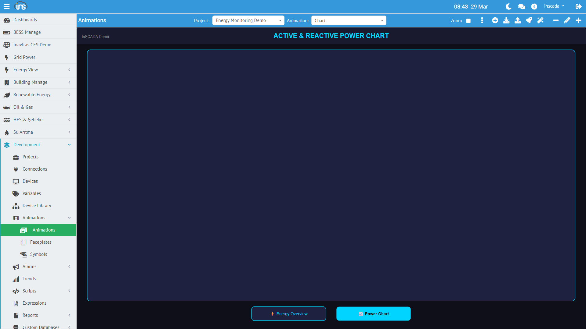

SVG Animation, inSCADA'nın temel görselleştirme bileşenidir. Her animation bir SVG dosyasından oluşur ve değişken değerlerine bağlanarak gerçek zamanlı SCADA ekranları oluşturur.


## Ekran Geliştirme Süreci

Bir SCADA ekranı oluşturmak üç adımdan oluşur:

### 1. SVG Tasarımı (Harici Editör)

SVG ekranı, herhangi bir SVG editörü ile tasarlanır. **Inkscape** (ücretsiz, açık kaynak) önerilen editördür.

Tasarım sırasında:
- Ekranın görsel düzenini oluşturun (arka plan, cihaz sembolleri, metin alanları, butonlar, göstergeler)
- **SVG ID'leri ile ilgilenmenize gerek yok** — inSCADA bu ID'leri otomatik algılar
- Standart SVG öğeleri kullanın: `<rect>`, `<circle>`, `<text>`, `<path>`, `<g>`, `<image>`
- İstediğiniz kadar karmaşık tasarım yapabilirsiniz — katmanlar, gruplar, gradyanlar, filtreler

:::tip
Inkscape'te tasarım yaparken objelere anlamlı isimler vermek işinizi kolaylaştırır (Inkscape'te Object Properties → Label/ID). Ancak zorunlu değildir — inSCADA tüm SVG ağacını otomatik tarar.
:::

### 2. SVG Yükleme (Animation Dev)

Tasarlanan SVG dosyasını platforma yükleyin:

**Menü:** Development → Animations → Animation Dev



Yeni animation oluşturun veya mevcut bir animation'ın SVG içeriğini güncelleyin. SVG dosyası upload edildikten sonra ekranda görselleşir.

### 3. Animation Binding (Element Editor)

SVG yüklendikten sonra, ekran üzerinde **mouse ile objelere tıklayarak** her objeye animation davranışı bağlarsınız:

1. SVG üzerinde bir objeye **mouse ile tıklayın** — obje seçilir ve vurgulanır
2. Sağ üstteki **Element Editor** (sihirli değnek ikonu) butonuna tıklayın
3. Seçilen objenin tipine göre uygulanabilir animation tipleri otomatik listelenir
4. İstediğiniz animation tipini seçip yapılandırın
5. **Save** ile kaydedin


Bu üç adım sonucunda, Visualization ekranında çalıştırdığınızda SVG ekranı canlı SCADA verisiyle güncellenir.

Detaylı bilgi: [Element Editor →](/docs/tr/platform/animations/element-editor/)

### Preview (Ön İzleme)

Roket ikonuna tıklayarak animation'ı canlı olarak önizleyebilirsiniz:


### Animation Yapılandırma Paneli

Kalem ikonuna tıklayarak animation'ın genel ayarlarını (Duration, Play Order, Alignment, Scripts) düzenleyebilirsiniz:


## Animation Oluşturma

| Alan | Zorunlu | Açıklama |
|------|---------|----------|
| **Name** | Evet | Ekran adı (proje içinde benzersiz) |
| **SVG Content** | Evet | SVG kaynak kodu |
| **Duration** | Evet | Animasyon güncelleme periyodu (ms, min: 100) |
| **Play Order** | Evet | Sıralama (birden fazla ekran varsa) |
| **Main** | Evet | Ana ekran mı |
| **Color** | Hayır | Arka plan rengi |
| **Description** | Hayır | Açıklama |

## Animation Yapısı

Her animation üç bileşenden oluşur:

```
Animation
├── SVG Content (ekranın görsel yapısı)
├── Animation Elements (değişken bağlantıları)
│   ├── Element 1: "temp_text" → Temperature_C (Get binding)
│   ├── Element 2: "motor_rect" → MotorStatus (Color binding)
│   └── Element 3: "valve_group" → ValvePosition (Rotate binding)
└── Animation Scripts (ekran scriptleri)
    ├── Pre-Animation Code
    └── Post-Animation Code
```

## Animation Elements

Animation Element, SVG içindeki bir DOM öğesini bir değişkene bağlar. Her element şu alanlardan oluşur:

| Alan | Zorunlu | Açıklama |
|------|---------|----------|
| **Name** | Evet | Element adı |
| **DOM ID** | Evet | SVG içindeki hedef öğenin `id` özniteliği |
| **Type** | Evet | Animation tipi (binding davranışı) |
| **Expression Type** | Evet | İfade tipi (değerin nasıl hesaplanacağı) |
| **Expression** | Evet | Değer ifadesi (değişken adı, formül vb.) |
| **Props** | Evet | Ek özellikler (JSON) |
| **Status** | Evet | Aktif/pasif |

### Animation Tipleri

inSCADA **36 farklı animation tipi** destekler:

#### Veri Gösterimi

| Tip | Açıklama | Sayfa |
|-----|----------|-------|
| **Get** | Değişken değerini metin olarak göster | [Detay →](/docs/tr/platform/animations/get/) |
| **Color** | Öğenin rengini değere göre değiştir | [Detay →](/docs/tr/platform/animations/color/) |
| **Bar** | Değere göre çubuk yüksekliği/genişliği | [Detay →](/docs/tr/platform/animations/bar-scale/) |
| **Opacity** | Değere göre saydamlık | [Detay →](/docs/tr/platform/animations/opacity-visibility-blink/) |
| **Visibility** | Koşula göre göster/gizle | [Detay →](/docs/tr/platform/animations/opacity-visibility-blink/) |
| **Rotate** | Değere göre döndürme | [Detay →](/docs/tr/platform/animations/rotate-move/) |
| **Move** | Değere göre X/Y kaydırma | [Detay →](/docs/tr/platform/animations/rotate-move/) |
| **Scale** | Değere göre ölçekleme | [Detay →](/docs/tr/platform/animations/bar-scale/) |
| **Blink** | Koşula göre yanıp sönme | [Detay →](/docs/tr/platform/animations/opacity-visibility-blink/) |
| **Pipe** | Boru/hat akış animasyonu | [Detay →](/docs/tr/platform/animations/pipe-tooltip-image/) |
| **Tooltip** | Hover bilgi balonu | [Detay →](/docs/tr/platform/animations/pipe-tooltip-image/) |
| **Image** | Değere göre resim değiştirme | [Detay →](/docs/tr/platform/animations/pipe-tooltip-image/) |
| **AlarmIndication** | Alarm durumunu göster | [Detay →](/docs/tr/platform/animations/pipe-tooltip-image/) |

#### Grafik & Veri Tablosu

| Tip | Açıklama | Sayfa |
|-----|----------|-------|
| **Chart** | Grafik bileşeni | [Detay →](/docs/tr/platform/animations/chart-peity/) |
| **Peity** | Inline sparkline mini grafik | [Detay →](/docs/tr/platform/animations/chart-peity/) |
| **Datatable** | Tablo bileşeni | [Detay →](/docs/tr/platform/animations/chart-peity/) |

#### Kontrol & Etkileşim

| Tip | Açıklama | Sayfa |
|-----|----------|-------|
| **Set** | Değişkene değer yaz (click ile) | [Detay →](/docs/tr/platform/animations/set-button-click/) |
| **Slider** | Kaydırıcı ile değer ayarla | [Detay →](/docs/tr/platform/animations/slider-input/) |
| **Input** | Metin/sayı girişi | [Detay →](/docs/tr/platform/animations/slider-input/) |
| **Button** | Buton bileşeni | [Detay →](/docs/tr/platform/animations/set-button-click/) |
| **Click** | Tıklama olayı | [Detay →](/docs/tr/platform/animations/set-button-click/) |
| **MouseDown / MouseUp / MouseOver** | Fare olayları | [Detay →](/docs/tr/platform/animations/set-button-click/) |

#### Navigasyon & Gömme

| Tip | Açıklama | Sayfa |
|-----|----------|-------|
| **Open** | Başka bir animation'a geç | [Detay →](/docs/tr/platform/animations/open-iframe-faceplate/) |
| **Iframe** | Harici URL gömme | [Detay →](/docs/tr/platform/animations/open-iframe-faceplate/) |
| **Menu** | Menü açma | [Detay →](/docs/tr/platform/animations/open-iframe-faceplate/) |
| **Faceplate** | Faceplate bileşeni yerleştir | [Detay →](/docs/tr/platform/animations/open-iframe-faceplate/) |

#### Script & Gelişmiş

| Tip | Açıklama | Sayfa |
|-----|----------|-------|
| **Script** | Özel JavaScript çalıştır | [Detay →](/docs/tr/platform/animations/script-animate/) |
| **FormScript** | Form tabanlı script | [Detay →](/docs/tr/platform/animations/script-animate/) |
| **GetSymbol** | Symbol kütüphanesinden sembol yükle | [Detay →](/docs/tr/platform/animations/script-animate/) |
| **Animate** | CSS/SVG animasyon tetikle | [Detay →](/docs/tr/platform/animations/script-animate/) |
| **Access** | Yetki bazlı görünürlük | [Detay →](/docs/tr/platform/animations/script-animate/) |
| **Three** | 3D görselleştirme | [Detay →](/docs/tr/platform/animations/script-animate/) |
| **QRCodeGeneration** | QR kod oluşturma | [Detay →](/docs/tr/platform/animations/script-animate/) |
| **QRCodeScan** | QR kod okuma | [Detay →](/docs/tr/platform/animations/script-animate/) |

### Expression Tipleri

Her animation element'te değerin nasıl hesaplanacağını belirler:

| Tip | Açıklama |
|-----|----------|
| **Tag** | Doğrudan değişken adı referansı |
| **Expression** | JavaScript formülü |
| **Numeric** | Sabit sayısal değer |
| **Text** | Sabit metin değeri |
| **Switch** | Değere göre koşullu seçim |
| **Collection** | Birden fazla değişken koleksiyonu |
| **Set** | Değer yazma ifadesi |
| **Animation** | Başka bir animation referansı |
| **Url** | URL referansı |
| **Alarm** | Alarm durumu referansı |
| **Faceplate** | Faceplate referansı |
| **Animation Popup** | Popup animation açma |
| **Button** | Buton yapılandırması |
| **InSCADA View** | Platform görünüm referansı |
| **System Page** | Sistem sayfası referansı |
| **Html** | HTML içerik |
| **Custom Menu** | Custom menu referansı |
| **Tetra Color** | Dört renkli durum gösterimi (alarm renkleri) |

## Animation Scripts

Her animation'a script bağlanabilir:

| Script | Çalışma Zamanı | Kullanım |
|--------|---------------|----------|
| **Pre-Animation Code** | Ekran açıldığında | Başlangıç değerleri, veri çekme |
| **Post-Animation Code** | Ekran kapandığında | Temizlik |

## SVG Tasarım İlkeleri

### ID Kuralları

SVG öğelerine anlamlı `id` değerleri verin — Animation Element `domId` alanı bunları referans eder:

```xml
<text id="temp_display">--</text>
<rect id="motor_indicator" fill="#cccccc"/>
<g id="valve_group" transform="rotate(0)">
  <path d="..."/>
</g>
```

### Gerçek Zamanlı Güncelleme

Animation açıldığında WebSocket bağlantısı kurulur. Platform, `duration` parametresinde belirtilen aralıkta değişken değerlerini istemciye push eder ve binding'ler otomatik güncellenir.

### Placeholder (Parametrik Ekran)

Animation'lara placeholder tanımlanabilir. Aynı SVG tasarımı farklı parametrelerle (farklı cihaz, farklı değişken seti) tekrar kullanılabilir.
