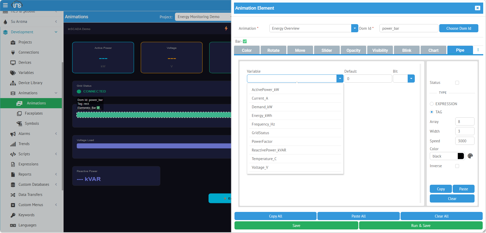
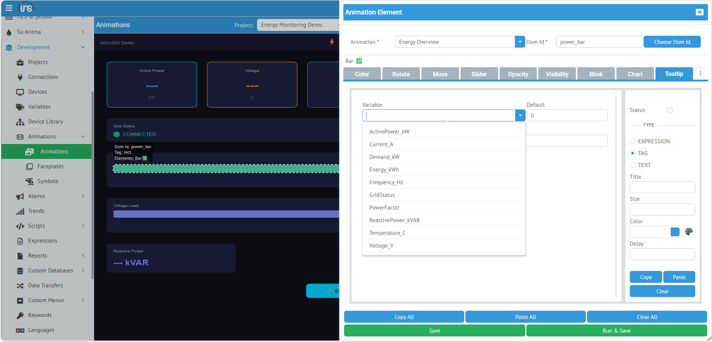
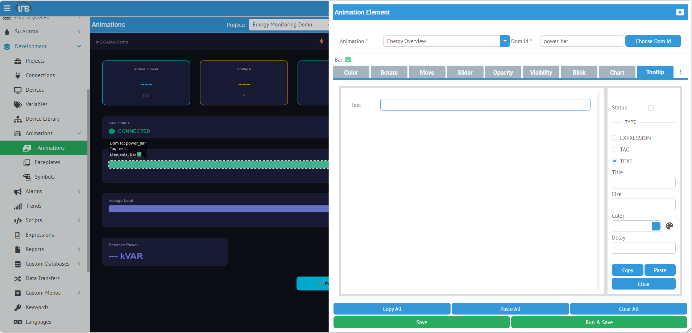
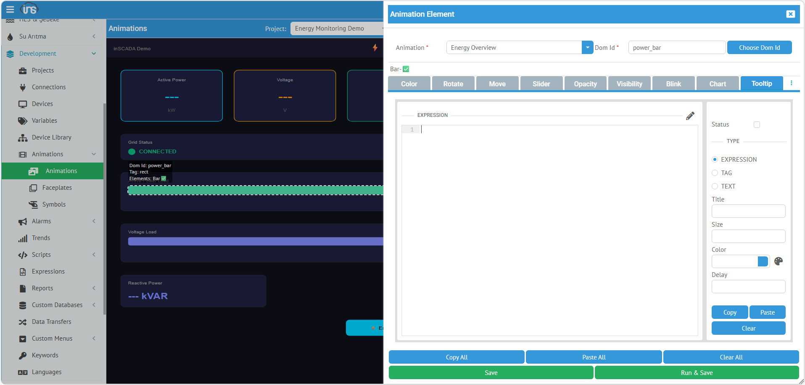

## Pipe (Akış Animasyonu)

**Pipe**, boru hatları veya kablolarda akış yönünü gösteren animasyon oluşturur. SVG çizgi üzerinde hareket eden tire deseni ile sıvı/gaz akışını görselleştirir.

| Alan | Değer |
|------|-------|
| **Type** | Pipe |
| **Uygun SVG Öğeleri** | `<path>`, `<line>`, `<polyline>`, `<rect>` |

### TAG — Değişken Seçimi



Boolean değişken seçilir. `true` → akış animasyonu başlar, `false` → durur.

| Alan | Açıklama |
|------|----------|
| **Variable** | Açılır listeden değişken seçimi |
| **Default** | Varsayılan durum |
| **Array** | `stroke-dasharray` değeri — tire deseni aralığı (varsayılan: 8). Büyük değer = uzun tireler |
| **Width** | `stroke-width` değeri — çizgi kalınlığı (varsayılan: 3) |
| **Speed** | Animasyon döngü süresi ms cinsinden (varsayılan: 3000). Küçük değer = hızlı akış |

### EXPRESSION — JavaScript ile Koşul


`true` veya `false` döndürülür. Array, Width, Speed alanları expression modunda da kullanılır.

```javascript
// Akış hızı > 0 ise boru animasyonu aktif
var flow = ins.getVariableValue("Flow_Rate").value;
return flow > 0;
```

### Çalışma Prensibi

Pipe, SVG `<animate>` elementi ile `stroke-dashoffset` değerini sürekli değiştirerek tire deseninin hareket etmesini sağlar. Bu sayede boru üzerinde akış yönü görsel olarak ifade edilir.

| Parametre | Etki |
|-----------|------|
| **Array = 4** | Kısa tireler, sık aralık |
| **Array = 16** | Uzun tireler, geniş aralık |
| **Width = 2** | İnce boru |
| **Width = 6** | Kalın boru |
| **Speed = 1000** | Hızlı akış |
| **Speed = 5000** | Yavaş akış |

---

## Tooltip (Bilgi Balonu)

**Tooltip**, SVG öğesi üzerine gelindiğinde (hover) popup bilgi balonu gösterir. Detay bilgi, ek parametreler, açıklama metinleri için kullanılır. **Tippy.js** kütüphanesi ile render edilir ve HTML içerik destekler.

| Alan | Değer |
|------|-------|
| **Type** | Tooltip |
| **Uygun SVG Öğeleri** | Tümü |

### TAG — Değişken Değeri ile Tooltip



Listeden değişken seçilir. Değişkenin güncel değeri tooltip içeriği olarak gösterilir.

| Alan | Açıklama |
|------|----------|
| **Variable** | Açılır listeden değişken seçimi |
| **Default** | Değer okunamadığında gösterilecek metin |

### TEXT — Sabit Metin



Sabit bir metin tooltip olarak gösterilir. HTML etiketleri desteklenir.

```html
<b>Aktif Güç Ölçümü</b><br>Trafometre çıkışı
```

### EXPRESSION — Dinamik HTML İçerik



JavaScript ile dinamik tooltip içeriği oluşturulur. HTML desteklenir.

```javascript
var p = ins.getVariableValue("ActivePower_kW");
var v = ins.getVariableValue("Voltage_V");
return "<b>Enerji Analizörü</b><br>"
     + "Güç: " + p.value.toFixed(1) + " kW<br>"
     + "Gerilim: " + v.value.toFixed(1) + " V<br>"
     + "Son güncelleme: " + new Date(p.dateInMs).toLocaleTimeString();
```

Kullanıcı SVG öğesi üzerine geldiğinde zengin HTML içerikli tooltip balonu görünür.

---

## Image (Dinamik Resim)

**Image**, bir SVG öğesine dinamik olarak resim yükler. Değere göre farklı resimler göstermek veya dosya sisteminden resim çekmek için kullanılır.

| Alan | Değer |
|------|-------|
| **Type** | Image |
| **Uygun SVG Öğeleri** | `<rect>`, `<image>` |

### EXPRESSION


Image yalnızca **EXPRESSION** tipini destekler. Döndürülen değer iki formatta olabilir:

#### Format 1: Dosya Yolu

```javascript
// Dosya sisteminden resim yükle
return {
    type: "file",
    value: "/files/images/motor-on.png"
};
```

#### Format 2: Base64 Veri

```javascript
// Veritabanından base64 resim
return {
    type: "database",
    value: "data:image/png;base64,iVBORw0KGgo..."
};
```

#### Örnek: Duruma Göre Resim Değiştirme

```javascript
var status = ins.getVariableValue("Motor_Status").value;
var base = "/files/images/motor-";
if (status === 0) return { type: "file", value: base + "off.png" };
if (status === 1) return { type: "file", value: base + "on.png" };
if (status === 2) return { type: "file", value: base + "fault.png" };
return { type: "file", value: base + "unknown.png" };
```

| Return Alanı | Açıklama |
|-------------|----------|
| **type: "file"** | Platform dosya sisteminden yükler (`/files/` dizini) |
| **type: "database"** | Base64 kodlanmış resim verisi doğrudan kullanılır |
| **value** | Dosya yolu veya base64 string |

---

## AlarmIndication (Alarm Göstergesi)

**AlarmIndication**, alarm grubunun durumunu otomatik olarak renk ve yanıp sönme ile gösterir. Alarm grubu tanımındaki renk ayarlarını kullanır.

| Alan | Değer |
|------|-------|
| **Type** | AlarmIndication |
| **Uygun SVG Öğeleri** | `<rect>`, `<circle>`, `<path>` |
| **Expression Type** | Alarm |

### 4 Alarm Durumu

| Durum | Açıklama | Tipik Görünüm |
|-------|----------|--------------|
| **Fired + No Ack** | Alarm aktif, onaylanmamış | Kırmızı yanıp söner |
| **Fired + Ack** | Alarm aktif, onaylanmış | Kırmızı sabit |
| **Off + No Ack** | Alarm kapanmış, onaylanmamış | Sarı |
| **Off + Ack** | Alarm kapanmış, onaylanmış | Normal (gri/beyaz) |

Renkler alarm grubu tanımından otomatik alınır — elle ayarlamaya gerek yoktur.
