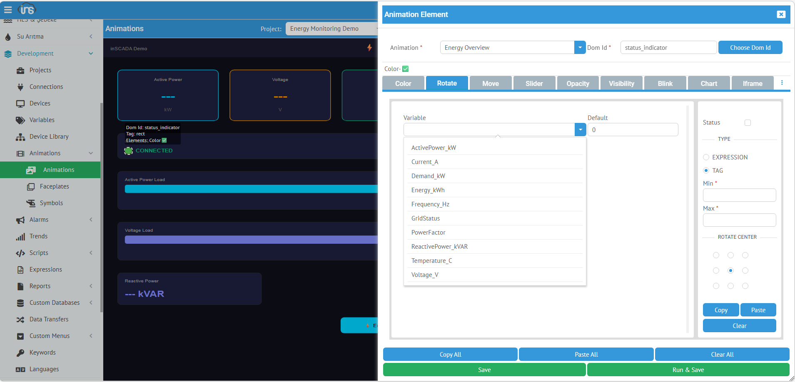
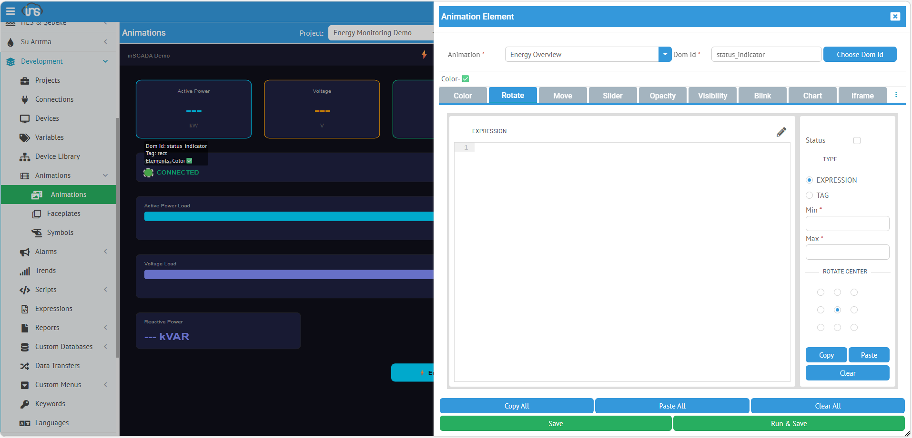
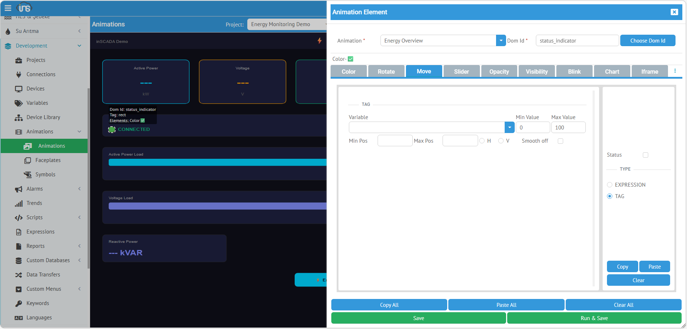

## Rotate (Döndürme)

**Rotate**, bir SVG öğesini değere göre döndürür. Gösterge ibresi, vana pozisyonu, rüzgar yönü, kompas gibi dairesel gösterimlerde kullanılır.

| Alan | Değer |
|------|-------|
| **Type** | Rotate |
| **Uygun SVG Öğeleri** | `<g>`, `<path>`, `<line>`, `<rect>` |

### TAG — Değişken Seçimi



Listeden değişken seçilir. Değer, Min-Max aralığına göre 0°-360° dönüş açısına dönüştürülür.

| Alan | Açıklama |
|------|----------|
| **Variable** | Açılır listeden değişken seçimi |
| **Min** | Minimum değer (bu değerde açı = 0°) |
| **Max** | Maksimum değer (bu değerde açı = 360°) |
| **Rotate Center** | Döndürme merkez noktası (pivot) |

#### Rotate Center (Döndürme Merkezi)

Objenin hangi noktası etrafında döneceğini belirler. 9 pozisyon seçilebilir:

| | Sol | Orta | Sağ |
|---|---|---|---|
| **Üst** | tl (top-left) | tc (top-center) | tr (top-right) |
| **Orta** | ml (mid-left) | mc (mid-center) | mr (mid-right) |
| **Alt** | bl (bottom-left) | bc (bottom-center) | br (bottom-right) |

Varsayılan: **mc** (objenin tam ortası)

Dönüş formülü: `açı = (değer - min) × 360 / (max - min)`

Örnek: Min=0, Max=100, Değer=25 → açı = 90°

### EXPRESSION — JavaScript ile Hesaplama



Derece cinsinden açı değeri döndürülür. Rotate Center alanı expression modunda da kullanılır.

```javascript
// Vana pozisyonu: 0 = kapalı (0°), 100 = açık (90°)
var pos = ins.getVariableValue("Valve_Position").value;
return pos * 0.9;
```

```javascript
// Rüzgar yönü (0-360°)
var dir = ins.getVariableValue("Wind_Direction").value;
return dir;
```

---

## Move (Kaydırma)

**Move**, bir SVG öğesini X ve/veya Y ekseninde değere göre kaydırır. Seviye göstergesi, konveyör pozisyonu, asansör gibi lineer hareket animasyonlarında kullanılır.

| Alan | Değer |
|------|-------|
| **Type** | Move |
| **Uygun SVG Öğeleri** | `<g>`, `<rect>`, `<circle>`, `<image>` |

### TAG — Değişken Seçimi



Listeden değişken seçilir. Değer aralığı piksel pozisyon aralığına eşlenir.

| Alan | Açıklama |
|------|----------|
| **Variable** | Açılır listeden değişken seçimi |
| **Min Value** | Minimum değişken değeri |
| **Max Value** | Maksimum değişken değeri |
| **Min Pos** | Minimum piksel pozisyonu (Min Value'da objenin konumu) |
| **Max Pos** | Maksimum piksel pozisyonu (Max Value'da objenin konumu) |
| **Smooth Off** | İşaretlenirse animasyon geçişi devre dışı kalır (anlık pozisyon atlaması) |

Pozisyon formülü:
```
oran = (değer - minValue) / (maxValue - minValue)
pozisyon = minPos + (maxPos - minPos) × oran
```

Örnek: MinValue=0, MaxValue=10, MinPos=0, MaxPos=300, Değer=5 → pozisyon = 150px

**Smooth Off**: Varsayılan olarak pozisyon değişimleri yumuşak animasyonla geçiş yapar. Smooth Off işaretlenirse obje anlık olarak yeni pozisyona atlar — hızlı değişen veriler için daha uygun olabilir.

### EXPRESSION — JavaScript ile Hesaplama


Piksel pozisyonu döndürülür. Min/Max alanları expression modunda da kullanılır.

```javascript
// Tank seviyesi: 0-100% → Y pozisyon 200-0 (ters yön)
var level = ins.getVariableValue("Tank_Level").value;
return 200 - (level * 2);
```

```javascript
// Konveyör pozisyonu
var pos = ins.getVariableValue("Conveyor_Position").value;
return pos * 3; // 0-100 → 0-300px
```

### Kullanım Örnekleri

#### Asansör

```xml
<svg viewBox="0 0 100 400">
  <rect x="20" y="10" width="60" height="380" fill="none" stroke="#999"/>
  <g id="elevator_cabin">
    <rect x="25" y="0" width="50" height="40" fill="#3498db" rx="3"/>
  </g>
</svg>
```

- TYPE: TAG, Variable: `Floor_Position`
- Min Value: `0`, Max Value: `10`, Min Pos: `350`, Max Pos: `10`
- Kat 0'da kabin en altta, kat 10'da en üstte

#### Seviye Göstergesi

- TYPE: TAG, Variable: `Tank_Level`
- Min Value: `0`, Max Value: `100`, Min Pos: `200`, Max Pos: `0`
- %0'da ok en altta, %100'de en üstte
