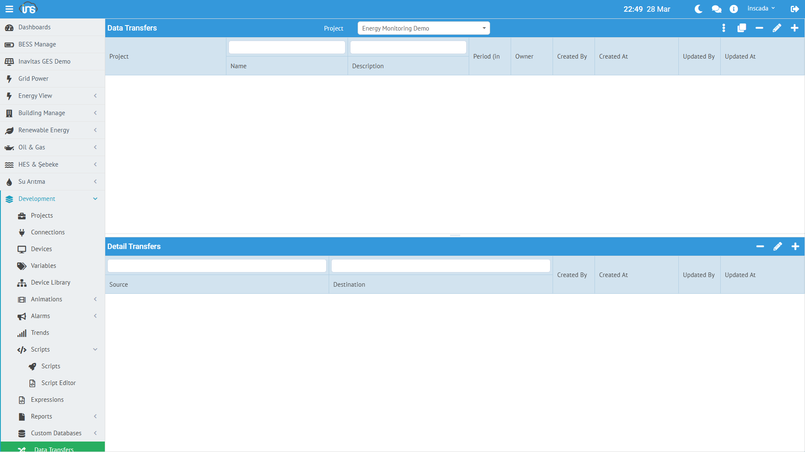

Data Transfer, bir projedeki değişken değerlerini başka bir projedeki değişkenlere periyodik olarak aktarır. Kaynak değişkenden istatistiksel hesaplama yaparak hedef değişkene yazmayı sağlar.



## Data Transfer Oluşturma

**Menü:** Development → Data Transfers → Yeni Transfer

| Alan | Zorunlu | Açıklama |
|------|---------|----------|
| **Name** | Evet | Transfer adı |
| **Project** | Evet | Bağlı proje |
| **Period** | Evet | Çalışma periyodu (ms, min: 1000) |
| **Description** | Hayır | Açıklama |

## Transfer Detayları

Her Data Transfer birden fazla **transfer detayı** (satır) içerir. Her satır bir kaynak-hedef eşleşmesidir:

| Alan | Açıklama |
|------|----------|
| **Source Variable** | Kaynak değişken |
| **Target Variable** | Hedef değişken |
| **Calculation Type** | İstatistik hesaplama tipi |
| **Range Type** | Zaman aralığı tipi |
| **Threshold** | Eşik değeri (opsiyonel) |

### Hesaplama Tipleri

| Tip | Açıklama |
|-----|----------|
| **LAST** | Son değer |
| **AVG** | Ortalama |
| **MIN** | Minimum |
| **MAX** | Maksimum |
| **SUM** | Toplam |
| **COUNT** | Kayıt sayısı |
| **DIFF** | İlk ve son değer farkı |

### Zaman Aralığı Tipleri

| Tip | Açıklama |
|-----|----------|
| **CURRENT** | Son periyot aralığındaki veriler |
| **PREVIOUS** | Bir önceki periyot aralığı |

## Kullanım Senaryoları

### Saatlik Enerji Tüketimi

Bir enerji sayacından saatlik tüketim hesaplayıp başka bir değişkene yazma:
- Kaynak: `Energy_kWh` (kümülatif sayaç)
- Hedef: `Hourly_Consumption`
- Hesaplama: DIFF (son - ilk = saatlik tüketim)
- Periyot: 3600000 ms (1 saat)

### Günlük Ortalama Sıcaklık

- Kaynak: `Temperature_C`
- Hedef: `DailyAvg_Temperature`
- Hesaplama: AVG
- Periyot: 86400000 ms (24 saat)

### Projeler Arası Veri Toplama

Birden fazla sahadaki güç değerlerini merkezi bir projeye toplama:
- Kaynak (Proje A): `Site1_Power_kW`
- Hedef (Merkez Proje): `Total_Power`
- Hesaplama: LAST

## Script ile Yönetim

```javascript
// Transfer görevini başlat
ins.scheduleDataTransfer("hourly_energy_calc");

// Transfer görevini iptal et
ins.cancelDataTransfer("hourly_energy_calc");
```

Detaylı API: [Data Transfer API →](/docs/tr/platform/scripts/datatransfer-api/)
