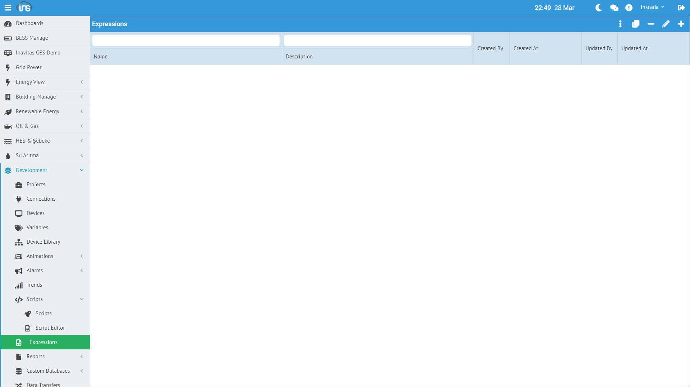

Expression, space seviyesinde tanımlanan paylaşımlı JavaScript formülleridir. Birden fazla değişken veya alarm tarafından referans olarak kullanılabilir. Tekrarlayan formülleri merkezi olarak yönetmeyi sağlar.



## Expression Oluşturma

**Menü:** Development → Expressions → Yeni Expression

| Alan | Zorunlu | Açıklama |
|------|---------|----------|
| **Name** | Evet | Formül adı (space içinde benzersiz) |
| **Code** | Evet | JavaScript kodu |
| **Description** | Hayır | Açıklama |

## Kullanım Alanları

Expression iki farklı amaçla kullanılır:

### Value Expression

Değişkenin değerini hesaplamak için kullanılır. Her okuma döngüsünde çalışır.

| Tip | Açıklama |
|-----|----------|
| **NONE** | Expression yok, ham değer kullanılır |
| **CUSTOM** | Değişkene özel inline JavaScript |
| **REFERENCE** | Paylaşımlı Expression'a referans |

REFERENCE seçildiğinde, değişken tanımında Expression adı belirtilir. Bu sayede aynı formül onlarca değişkende kullanılabilir.

### Log Expression

Değişkenin ne zaman loglanacağını belirleyen özel koşul. `true` dönerse loglanır, `false` dönerse atlanır.

```javascript
// Sadece değer belirli aralıkta ise logla
if (value > 100 && value < 900) {
    return true;
}
return false;
```

## Örnek Expression'lar

### Birim Dönüşümü

```javascript
// Fahrenheit → Celsius (birden fazla sıcaklık sensöründe kullanılır)
return ((value - 32) * 5 / 9).toFixed(1) * 1;
```

### Ölçek Normalizasyonu

```javascript
// 0-65535 raw değeri 0-100 yüzdeye çevir
return (value / 65535 * 100).toFixed(1) * 1;
```

### Durum Metni

```javascript
// Sayısal durum kodunu metne çevir
var states = {0: "Durdu", 1: "Çalışıyor", 2: "Arıza", 3: "Bakım"};
return states[value] || "Bilinmiyor";
```

## Space Seviyesi Avantajı

Expression space seviyesinde tanımlandığı için:
- Bir formülü değiştirdiğinizde, onu kullanan **tüm değişkenler** otomatik güncellenir
- Farklı projelerdeki değişkenler aynı formülü paylaşabilir
- Formül kütüphanesi oluşturarak standart dönüşümler tanımlanabilir
