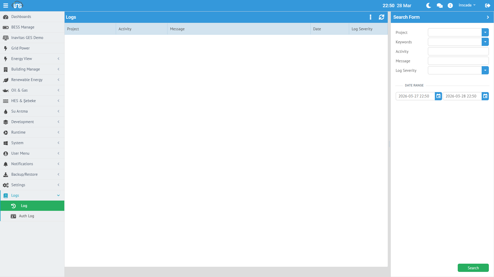

inSCADA, platform üzerindeki tüm önemli olayları otomatik olarak kaydeder. Loglar zaman serisi veritabanında tutulur ve tarih aralığına göre sorgulanabilir.

## Olay Logları (Event Log)

**Menü:** Logs → Log



Her olay kaydı aşağıdaki bilgileri içerir:

| Alan | Açıklama |
|------|----------|
| **activity** | İşlem adı |
| **msg** | Log mesajı |
| **logSeverity** | Seviye: Information, Warning, Error |
| **dttm** | Zaman damgası |
| **projectId** | İlgili proje |

### Otomatik Kaydedilen Olaylar

| Olay | Seviye | Açıklama |
|------|--------|----------|
| Script hatası | Error | Script çalışma hataları ve stack trace |
| Bağlantı değişikliği | Information | Bağlantı başlatma/durdurma |
| Yapılandırma değişikliği | Information | Proje, değişken, alarm CRUD işlemleri |
| Kullanıcı işlemi | Information | Giriş, çıkış, şifre değişikliği |

### Script ile Log Yazma

Script'ler içinden manuel log kaydı oluşturulabilir:

```javascript
ins.writeLog("INFO", "Otomasyon", "Vardiya değişimi tamamlandı");
// → OK
```

### Log Sorgulama

```javascript
var end = ins.now();
var start = ins.getDate(end.getTime() - 3600000); // 1 saat
var logs = ins.getLogsByPage(start, end, 0, 10);
```

Yanıt:
```json
[
  {
    "activity": "Script Test",
    "dttm": 1774688982859,
    "msg": "Documentation test log entry",
    "projectId": 153,
    "logSeverity": "Information"
  }
]
```

### Saklama Süresi

Olay logları varsayılan olarak **14 gün** tutulur. Bu süre InfluxDB retention policy (`event_log_rp`) ile belirlenir.

---

## Giriş Denemeleri (Auth Log)

**Menü:** System → Auth Log

Tüm giriş denemeleri (başarılı ve başarısız) kaydedilir:

```json
{
  "msg": "inscada logged in successfully",
  "ip": "0:0:0:0:0:0:0:1",
  "username": "inscada",
  "date": { "epochSecond": 1774689046 },
  "isSuccessful": true
}
```

| Alan | Açıklama |
|------|----------|
| **username** | Giriş deneyen kullanıcı |
| **ip** | İstemci IP adresi |
| **isSuccessful** | Başarılı mı |
| **msg** | Detay mesajı |
| **date** | Zaman damgası |

### Güvenlik İzleme

```javascript
// Başarısız giriş denemelerini kontrol et
var attempts = ins.getLastAuthAttempts();
var failed = 0;
for (var i = 0; i < attempts.size(); i++) {
    if (!attempts.get(i).isSuccessful) {
        failed++;
    }
}
if (failed > 5) {
    ins.notify("error", "Güvenlik",
        failed + " başarısız giriş denemesi!");
}
```

### Saklama Süresi

Giriş denemeleri **365 gün** tutulur (`auth_attempt_rp`).

---

## Çevrimiçi Kullanıcılar

**Menü:** System → Auth Log → Online Users

Şu anda oturum açmış kullanıcıları gösterir. Yönetici, aktif oturumları sonlandırabilir.

---

## Script Logları

Script'lerin `log: true` ayarı açıksa, her çalıştırma sonucu otomatik olarak loglanır:
- Başarılı çalışma süresi
- Hata durumunda hata mesajı ve stack trace

```json
{
  "activity": "test",
  "msg": "Script test failed. Cause: TypeError: ins.getScripts is not a function",
  "logSeverity": "Error"
}
```

---

## Console Log

`ins.consoleLog()` ile debug amaçlı log yazılabilir:

```javascript
ins.consoleLog("Debug: power = " + power + " kW");
```

Bu loglar sunucu konsol çıktısında görünür (stdout).

Detaylı API: [Log API →](/docs/tr/platform/scripts/log-api/)
