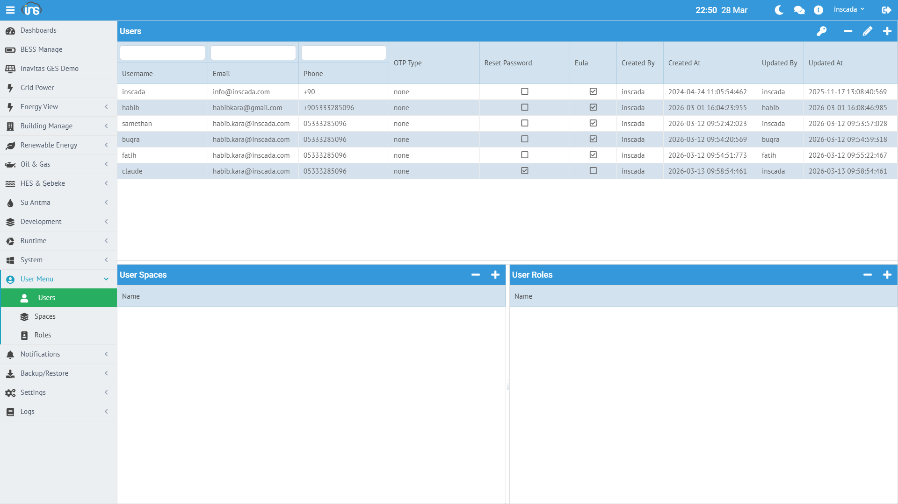
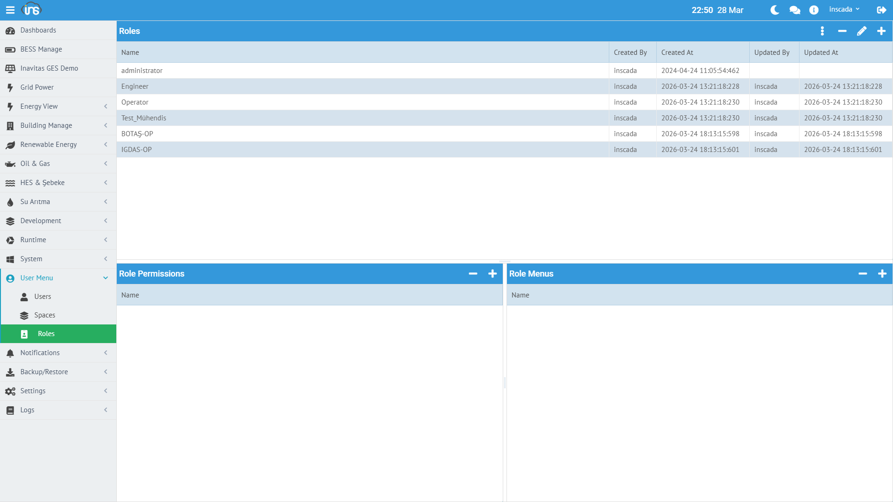

inSCADA, rol tabanlı erişim kontrolü (RBAC) ile kullanıcı yetkilendirmesi sağlar. Kullanıcılar rollere, roller yetkilere ve menülere bağlanır.

## Kullanıcı Yönetimi

**Menü:** User Menu → Users



### Kullanıcı Oluşturma

| Alan | Zorunlu | Açıklama |
|------|---------|----------|
| **Username** | Evet | Giriş kullanıcı adı (değiştirilemez) |
| **Password** | Evet | Şifre (şifreli saklanır) |
| **Email** | Hayır | E-posta adresi (bildirimler için) |
| **Phone** | Hayır | Telefon numarası (SMS bildirimleri için) |
| **Roles** | Evet | Atanacak roller |
| **Spaces** | Evet | Erişebileceği space'ler |

### İki Faktörlü Doğrulama (OTP)

| Tip | Açıklama |
|-----|----------|
| **NONE** | OTP kapalı |
| **SMS** | Giriş sırasında SMS ile doğrulama kodu |
| **MAIL** | Giriş sırasında e-posta ile doğrulama kodu |

### Şifre Politikaları

| Ayar | Açıklama |
|------|----------|
| **Require Password Reset** | Sonraki girişte şifre değişikliği zorla |
| **EULA Accepted** | Kullanım sözleşmesi onayı |

---

## Rol Yönetimi

**Menü:** User Menu → Roles



Rol, yetki ve menü gruplarının bir bütünüdür. Bir kullanıcıya birden fazla rol atanabilir — tüm rollerin yetkileri birleştirilir.

### Rol Oluşturma

| Alan | Zorunlu | Açıklama |
|------|---------|----------|
| **Name** | Evet | Rol adı |
| **Permissions** | Evet | Bu role atanacak yetkiler |
| **Menus** | Evet | Bu rolün göreceği menüler |

### Örnek Rol Yapıları

**Operatör Rolü:**
- Menüler: Home, Control Panel, Alarm Monitor, Trend Graphic
- Yetkiler: VIEW_VARIABLE, SET_VARIABLE_VALUE, VIEW_FIRED_ALARM, ACK_FIRED_ALARM, VIEW_ANIMATION

**Mühendis Rolü:**
- Menüler: Connections, Variables, Alarms, Scripts, Animations, Trends
- Yetkiler: Tüm CRUD yetkileri + RUN_SCRIPT + SCHEDULE_SCRIPT

**Yönetici Rolü:**
- Menüler: Tüm menüler
- Yetkiler: Tüm yetkiler

---

## Yetkiler (Permissions)

Yetkiler, platformdaki her işlem için granüler erişim kontrolü sağlar. Toplam **242 yetki** mevcuttur.

### Yetki Kategorileri

| Kategori | Yetkiler | Açıklama |
|----------|---------|----------|
| **Proje** | CREATE, VIEW, UPDATE, DELETE, EXPORT, IMPORT | Proje CRUD |
| **Bağlantı** | CREATE, VIEW, UPDATE, DELETE, EXPORT, IMPORT, START, STOP | Bağlantı yönetimi + kontrol |
| **Değişken** | CREATE, VIEW, UPDATE, DELETE, EXPORT, IMPORT, SET_VALUE | Değişken yönetimi + yazma |
| **Alarm** | CREATE, VIEW, UPDATE, DELETE, ACTIVATE, DEACTIVATE | Alarm tanımları |
| **Alarm Grubu** | CREATE, VIEW, UPDATE, DELETE, EXPORT, IMPORT | Alarm grupları |
| **Tetiklenen Alarm** | VIEW, ACK, FORCE_OFF | Alarm izleme |
| **Script** | CREATE, VIEW, UPDATE, DELETE, RUN, SCHEDULE, CANCEL | Script yönetimi + çalıştırma |
| **Rapor** | CREATE, VIEW, UPDATE, DELETE, SCHEDULE, CANCEL, PRINT, MAIL | Rapor yönetimi |
| **Animasyon** | CREATE, VIEW, UPDATE, DELETE, EXPORT, IMPORT | SVG ekran yönetimi |
| **Trend** | CREATE, VIEW, UPDATE, DELETE, EXPORT, IMPORT | Trend grafikleri |
| **Data Transfer** | CREATE, VIEW, UPDATE, DELETE, SCHEDULE, CANCEL | Veri aktarımı |
| **Kullanıcı** | CREATE, VIEW, UPDATE, DELETE, RESET_PASSWORD | Kullanıcı yönetimi |
| **Rol** | CREATE, VIEW, UPDATE, DELETE, EXPORT, IMPORT | Rol yönetimi |
| **Dashboard** | CREATE, VIEW, UPDATE, DELETE, EXPORT, IMPORT | Pano yönetimi |
| **Custom Menu** | CREATE, VIEW, UPDATE, DELETE, EXPORT, IMPORT | Özel menü |
| **Expression** | CREATE, VIEW, UPDATE, DELETE, EXPORT, IMPORT | Formül yönetimi |
| **E-posta** | SEND, VIEW_SENT, VIEW_SETTINGS, UPDATE_SETTINGS | E-posta |
| **SMS** | SEND, VIEW_SENT, VIEW_SETTINGS, UPDATE_SETTINGS | SMS |
| **Log** | VIEW, TRUNCATE | Denetim logları |
| **Lisans** | VIEW, ACTIVATE | Lisans yönetimi |
| **Sistem** | VIEW_SYSTEM_STATS, EXEC_SYSTEM_COMMAND | Sistem komutları |
| **Dil** | CREATE, VIEW, UPDATE, DELETE, EXPORT, IMPORT | Çoklu dil |

### Kritik Yetkiler

| Yetki | Açıklama |
|-------|----------|
| **SET_VARIABLE_VALUE** | Değişkene değer yazma (kontrol komutu) |
| **RUN_SCRIPT** | Script çalıştırma (sunucu tarafı kod) |
| **EXEC_SYSTEM_COMMAND** | OS komutu çalıştırma |
| **START_CONNECTION / STOP_CONNECTION** | Bağlantı başlatma/durdurma |
| **FORCE_OFF_FIRED_ALARM** | Alarmı zorla kapatma |

:::caution
Bu yetkiler yalnızca güvenilir kullanıcılara verilmelidir. Özellikle `RUN_SCRIPT` ve `EXEC_SYSTEM_COMMAND` sunucu tarafında kod çalıştırma yetkisi verir.
:::

---

## Menüler

Menüler, kullanıcının arayüzde göreceği sayfaları belirler. Bir role birden fazla menü atanabilir.

### Menü Kategorileri

| Kategori | Menüler |
|----------|---------|
| **Ana Sayfa** | Home |
| **Çalışma Ortamı** | Control Panel, Process, Processes |
| **İzleme** | Alarm Monitor, Alarm History, Trend Graphic, Variable History, Variable Monitor |
| **Yapılandırma** | Projects, Connections, Devices, Variables, Alarms, Alarm Groups |
| **Geliştirme** | Development, Scripts, Expressions, Animations, Trends, Reports, Data Transfers |
| **Görselleştirme** | Visualization, Project Map, Custom Menu Dev |
| **Sistem** | Users, Roles, License, Log, Job, Auth Log, Keywords, Languages |
| **Bildirim** | Notifications, Email, SMS |
| **Veri** | Backup/Restore, Device Library |

---

## Space Erişimi

Kullanıcılar birden fazla space'e erişebilir. Login yanıtında erişilebilir space listesi döner:

```json
{
  "expire-seconds": 300,
  "spaces": ["default_space", "production", "test"]
}
```

Kullanıcı oturum sırasında `X-Space` header'ı ile space değiştirebilir.
