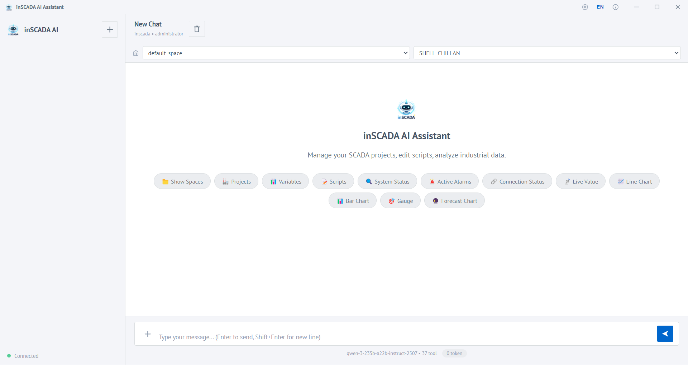
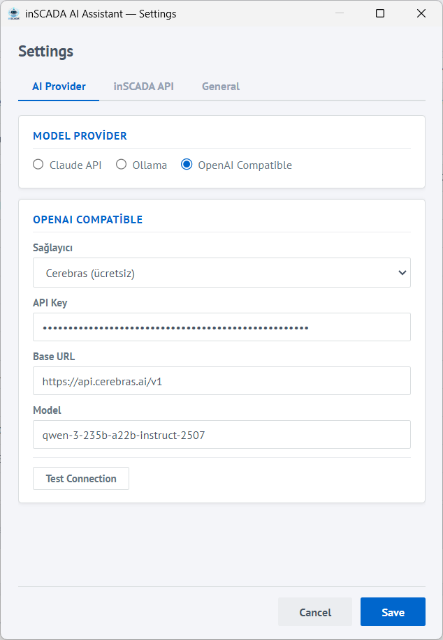
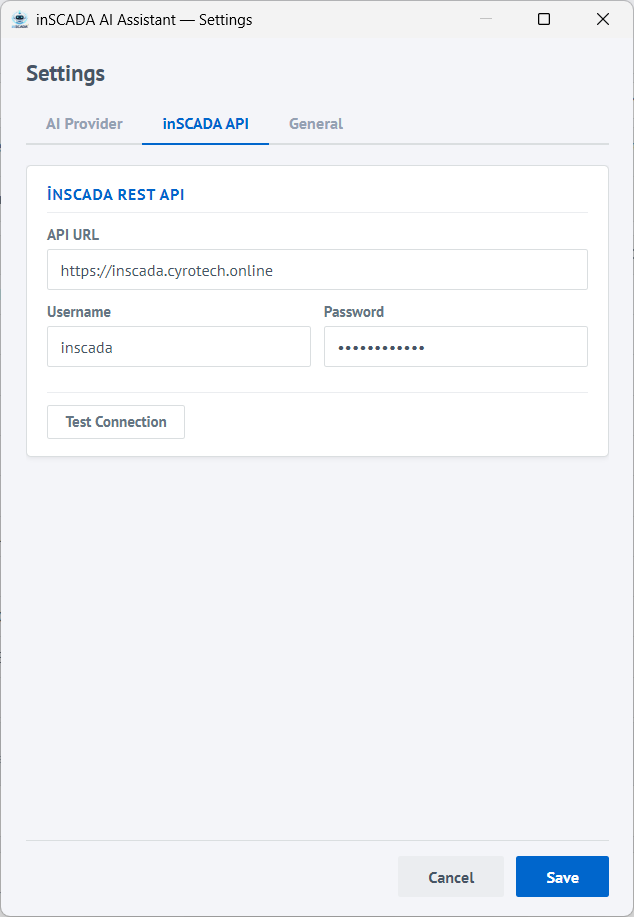
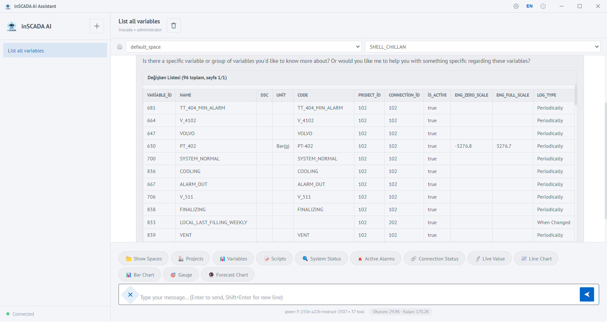

inSCADA, yapay zeka asistanlarini dogrudan SCADA sisteminize baglayan iki farkli cozum sunar. Her iki cozum de ayni **39 arac** setini kullanarak canli deger okuma, alarm izleme, script yazma, tarihsel veri analizi, grafik olusturma ve daha fazlasini yapmanizi saglar.

> **Not:** Her iki cozum de **inSCADA JDK11** surumu gerektirir.

## Cozumunuzu Secin

| | MCP Server | AI Asistan (Masaustu) |
|---|---|---|
| **Platform** | Claude Desktop, VS Code Copilot, Cursor | Bagimsiz Windows uygulamasi |
| **Kurulum** | .mcpb veya JSON config | Installer (.exe) |
| **AI Saglayici** | Claude (abonelik) | Claude, Ollama, Gemini, Groq vb. |
| **Veri gizliligi** | Veriler Claude sisteminden gecer | Ollama ile %100 lokal |
| **Maliyet** | Claude Pro/Max abonelik | API token maliyeti (Ollama haric) |
| **Arayuz** | Claude Desktop icinden | Kendi sohbet arayuzu (TR/EN) |
| **Detay** | [MCP Server](/docs/tr/ai/mcp-server/) | Asagidaki bolumler |

## Yetenekler

- **Dogal dilde sorgulama** — Turkce veya Ingilizce konusarak SCADA verilerinizi sorgulayabilirsiniz
- **Canli veri & grafikler** — Cizgi, cubuk, gauge ve tahmin grafikleri olusturun
- **Alarm analizi** — Aktif alarmlari sorgulayip alarm gecmisini analiz edin
- **Script gelistirme** — Nashorn ES5 uyumlu scriptler yazin, test edin ve deploy edin
- **Excel export** — Sorgu sonuclarini .xlsx olarak disa aktarin
- **API kesfi** — 625+ inSCADA endpoint'ini kesfedip dogal dille cagriin

## 39 Arac — 8 Kategori

| Kategori | Arac Sayisi | Aciklama |
|----------|-------------|----------|
| Space & Veri | 10 | Space, proje, degisken, degisken arama, script, baglanti yonetimi |
| Animasyon | 2 | Animasyon listeleme ve detaylari |
| SCADA Operasyonlari | 10 | Canli deger, alarm, baglanti durumu, tarihsel veri |
| Grafikler | 5 | Cizgi, cubuk, gauge, coklu seri, tahmin grafikleri |
| Custom Menu | 6 | Menu CRUD islemleri (sablonlu olusturma destegi) |
| Genel API | 3 | 625+ endpoint kesfi ve cagrisi |
| Disa Aktarma | 1 | Excel dosyasi olusturma |
| Kilavuz | 2 | Script kurallari, animasyon element detaylari, en iyi pratikler |

## AI Asistan — Masaustu Uygulama

Bagimsiz Windows uygulamasi. Kendi AI saglayicinizi secin, Ollama ile tamamen lokal calisin — verileriniz bilgisayarinizdan cikmaz.



### Desteklenen AI Saglayicilari

| Saglayici | Aciklama |
|-----------|----------|
| **Claude** (Anthropic) | Onerilen. Karmasik SCADA analizleri ve uzun script uretimi icin ideal |
| **Ollama** (Yerel) | Bilgisayarinizda calisan acik kaynak modeller. Internet gerektirmez, veri disari cikmaz |
| **OpenAI Uyumlu** | Google Gemini, Groq, Cerebras, OpenRouter ve diger OpenAI uyumlu API saglayicilari |

### Kurulum

1. [inscada.com/download](https://inscada.com/download/) sayfasindan **inSCADA AI Asistan** installer'ini indirin
2. Installer'i calistirin ve kurulumu tamamlayin
3. Uygulamayi baslatin

**Gereksinimler:** Windows 10/11, calisan bir inSCADA sunucusu (JDK11 surumu)

### Ilk Yapilandirma

Uygulama ilk acildiginda ayarlar sayfasindan yapilandirma yapmaniz gerekir:

**1. AI Saglayici Secimi:**
- **Claude:** Anthropic API anahtarinizi girin
- **Ollama:** Ollama sunucu adresini girin (varsayilan: `http://localhost:11434`)
- **OpenAI Uyumlu:** Saglayici secin, API URL ve anahtarinizi girin



**2. inSCADA Baglantisi:**
- **inSCADA URL:** Sunucu adresi (ornegin `http://localhost:8081`)
- **Kullanici Adi:** inSCADA login kullanici adi
- **Sifre:** inSCADA login sifresi
- **Test Connection:** Baglanti ayarlarini dogrulamak icin test butonunu kullanin



### Ozellikler

- **Sohbet arayuzu** — Turkce ve Ingilizce tam destek, konusma gecmisi
- **Excel export** — Sorgu sonuclarini .xlsx dosyasi olarak indirin
- **Canli gauge** — 2 saniyede bir otomatik guncellenen gosterge panelleri
- **Tahmin grafikleri** — Tarihsel veri uzerinden AI tahmini, ayni grafik uzerinde gorsellestirilir
- **Script gelistirme** — Script yazma, test etme ve deploy etme — tek sohbetten
- **Onay mekanizmasi** — Tehlikeli islemler icin UI uzerinden onay kutusu



## Guvenlik

### Tehlikeli Araclar
Asagidaki araclar gercek ekipmanlari etkiler ve her kullaninda **kullanici onayi** gerektirir:

- **`inscada_set_value`** — Gercek ekipmana deger yazar (PLC, invertor vb.)
- **`inscada_run_script`** — Sunucu tarafinda script calistirir
- **`update_script`** — Script kodunu degistirir
- **`inscada_api`** (POST/PUT/DELETE) — Genel API uzerinden veri degistirir

**MCP Server'da:** Bu araclar MCP guvenlik anotasyonlari (`destructiveHint: true`) ile isaretlenmistir. AI istemci, cagirmadan once kullanicidan onay ister.

**AI Asistan'da:** Sunucu tarafinda engellenip `pendingActions` kuyraguna alinir. Kullanici UI uzerindeki onay kutusundan Onayla/Iptal secer.

### Veri Gizliligi
- Kimlik bilgileri sadece lokal makinede saklanir
- AI Asistan sadece `127.0.0.1`'e bind olur — agdan erisim engellenir
- Ollama kullanildiginda hicbir veri disari cikmaz
- MCP Server'da oturum token'lari bellekte tutulur, uygulama kapatildiginda silinir

## Kullanim Ornekleri

Birkaç ornek prompt:

**Canli deger:**
```
claude space, Energy Monitoring Demo, ActivePower_kW degeri?
```

**Grafik:**
```
claude space, Energy Monitoring Demo, ActivePower_kW son 24 saat grafigi
```

**Script yazma (kilavuz gerekli):**
```
inscada guide oku. claude space, Energy Monitoring Demo,
her 10 saniyede sicaklik 60°C uzerine cikinca bildirim gonderen script yaz
```

**Excel export:**
```
claude space, Energy Monitoring Demo, ActivePower_kW 24 saat verisini Excel'e aktar
```

Detayli senaryolar, prompt sablonlari ve token optimizasyonu icin: [Kullanim Rehberi](/docs/tr/ai/mcp-usage-guide/)
