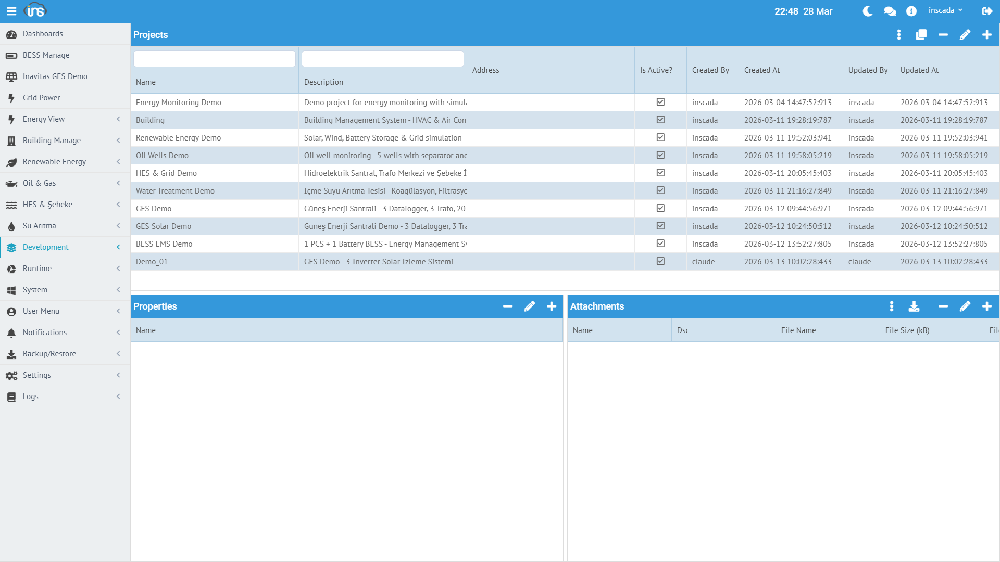

Bağlantı (Connection), bir saha cihazına veya sisteme olan haberleşme kanalıdır. Her bağlantı bir protokol kullanır ve bir projeye bağlıdır.



## Bağlantı Oluşturma

**Menü:** Runtime → Connections → Yeni Bağlantı

| Alan | Zorunlu | Açıklama |
|------|---------|----------|
| **Name** | Evet | Bağlantı adı (proje içinde benzersiz) |
| **Protocol** | Evet | Haberleşme protokolü |
| **IP** | Protokole göre | Hedef IP adresi |
| **Port** | Protokole göre | Hedef port numarası |
| **Description** | Hayır | Açıklama |

## Desteklenen Protokoller

| Protokol | Kullanım Alanı | Tipik Cihaz |
|----------|---------------|-------------|
| **MODBUS TCP** | Endüstriyel otomasyon | PLC, enerji analizörü, sürücü |
| **MODBUS UDP** | Hızlı okuma gerektiren uygulamalar | Enerji sayacı |
| **MODBUS RTU over TCP** | Seri haberleşme gateway | RTU, seri cihaz |
| **DNP3** | Enerji dağıtım | RTU, koruma rölesi |
| **IEC 60870-5-104** | Enerji iletim/dağıtım | RTU, SCADA gateway |
| **IEC 61850** | Trafo merkezi | IED, koruma rölesi |
| **OPC UA** | Açık standart | PLC, DCS, SCADA |
| **OPC DA** | Windows COM/DCOM | Eski nesil OPC sunucular |
| **OPC XML** | HTTP/SOAP tabanlı | Web servis OPC |
| **S7** | Siemens PLC | S7-300, S7-400, S7-1200, S7-1500 |
| **MQTT** | IoT / mesaj tabanlı | Gateway, sensör, broker |
| **EtherNet/IP** | Rockwell/Allen-Bradley | Logix 5000+ serisi |
| **Fatek** | Fatek PLC | FBs, FBe serisi |
| **LOCAL** | Simülasyon / hesaplama | Dahili değişken |

Detaylı protokol ayarları: [Protokoller →](/docs/tr/protocols/)

## Bağlantı Durumları

| Durum | Açıklama |
|-------|----------|
| **Connected** | Bağlantı aktif, veri okunuyor |
| **Disconnected** | Bağlantı kesilmiş |
| **Error** | Bağlantı hatası (timeout, yetki vb.) |

## Bağlantı Yapısı (Örnek)

```json
{
  "id": 153,
  "name": "LOCAL-Energy",
  "protocol": "LOCAL",
  "ip": "127.0.0.1",
  "port": 0,
  "projectId": 153,
  "dsc": "Local protocol connection for energy simulation"
}
```

## Bağlantı Başlatma / Durdurma

Bağlantılar arayüzden veya script ile yönetilebilir:

```javascript
// Durumu sorgula
var status = ins.getConnectionStatus("LOCAL-Energy");
// → "Connected"

// Durdur ve yeniden başlat
ins.stopConnection("MODBUS-PLC");
java.lang.Thread.sleep(2000);
ins.startConnection("MODBUS-PLC");
```

## Bağlantı Parametrelerini Güncelleme

Çalışma sırasında bağlantı parametreleri dinamik olarak değiştirilebilir:

```javascript
// IP adresini değiştir
ins.updateConnection("MODBUS-PLC", {
    "ip": "192.168.1.100",
    "port": 502
});
```

:::tip
Bağlantı parametresi güncellemesi sonrası bağlantıyı durdurup yeniden başlatmanız önerilir.
:::

Detaylı API: [Connection API →](/docs/tr/platform/scripts/connection-api/)
