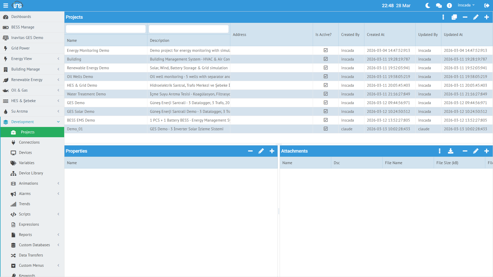

Proje, inSCADA'daki temel organizasyon birimidir. Bir tesis, saha veya mantıksal birim temsil eder. Tüm bağlantılar, değişkenler, alarmlar, script'ler ve ekranlar bir projeye bağlıdır.



## Proje Oluşturma

**Menü:** System → Projects → Yeni Proje

| Alan | Zorunlu | Açıklama |
|------|---------|----------|
| **Name** | Evet | Proje adı (space içinde benzersiz) |
| **Description** | Hayır | Açıklama |
| **Latitude / Longitude** | Hayır | GIS harita koordinatları |
| **Active** | Evet | Aktif/pasif durumu |

## Proje Durumu

Her projenin bileşen bazlı çalışma durumu izlenebilir:

```json
{
  "connectionStatuses": { "153": "Connected" },
  "scriptStatuses": { "160": "Not Scheduled", "159": "Not Scheduled" },
  "dataTransferStatuses": {},
  "reportStatuses": {},
  "alarmGroupStatuses": {}
}
```

| Bileşen | Olası Durumlar |
|---------|---------------|
| **Connection** | Connected, Disconnected, Error |
| **Script** | Running, Not Scheduled, Error |
| **Data Transfer** | Running, Not Scheduled |
| **Report** | Scheduled, Not Scheduled |
| **Alarm Group** | Active, Inactive |

## Proje Yapısı

Bir proje oluşturulduktan sonra içine eklenen bileşenler:

```
Project: "Energy Monitoring Demo"
├── Connection: LOCAL-Energy (LOCAL protokol)
│   └── Device: Energy-Device
│       └── Frame: Energy-Frame
│           ├── Variable: ActivePower_kW
│           ├── Variable: Voltage_V
│           ├── Variable: Current_A
│           └── ... (10 değişken)
├── Script: Chart_ActiveReactivePower
├── Script: Test_LoggedValues
├── Animation: (SVG ekranlar)
├── Trend: (grafik tanımları)
└── Report: (rapor tanımları)
```

## Proje Haritası

Projelere koordinat atanırsa, **Project Map** ekranında harita üzerinde görselleştirilebilir:

| Alan | Örnek |
|------|-------|
| **Latitude** | 37.9 |
| **Longitude** | 32.5 |

Harita üzerinde her proje noktası tıklandığında popup ile anlık durum bilgisi gösterilir.

## Script ile Proje Yönetimi

```javascript
// Tüm projeleri listele
var projects = ins.getProjects();

// Proje konumunu güncelle
ins.updateProjectLocation(41.0082, 28.9784);
```

Detaylı API: [Project API →](/docs/tr/platform/scripts/project-api/) | [REST API →](/docs/tr/api/projects/)
